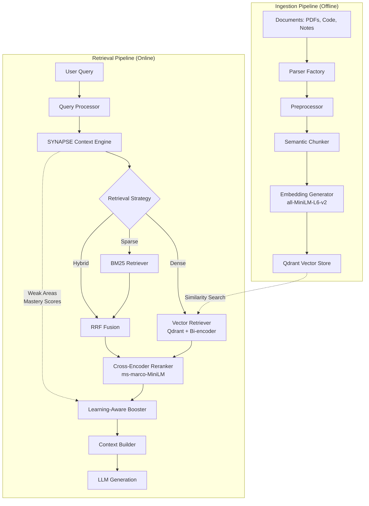
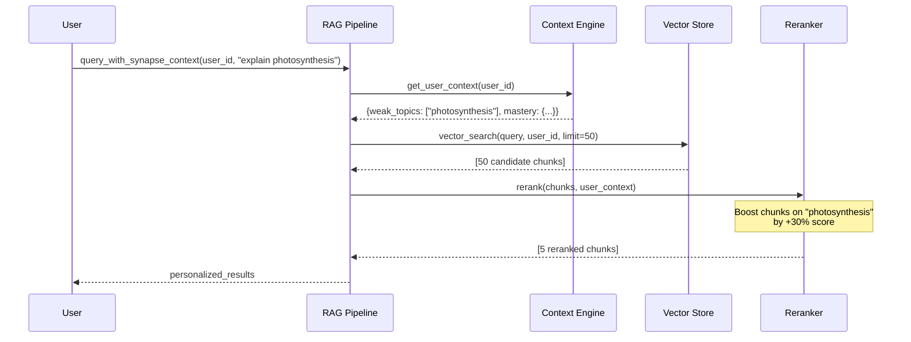
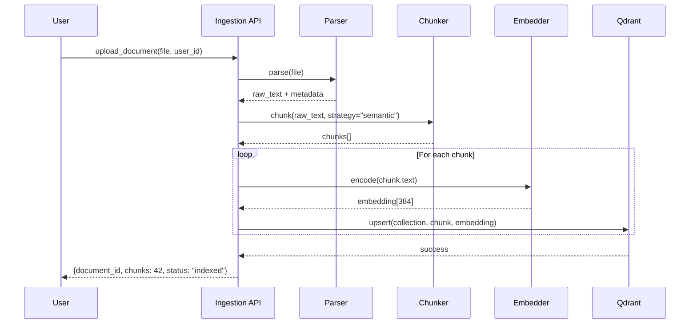
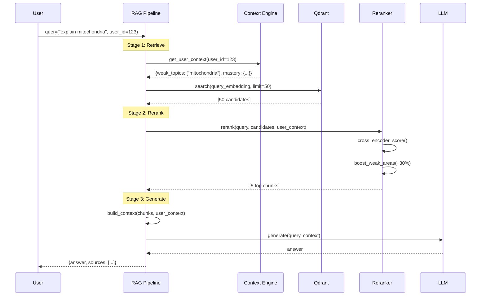

# 🧠 SYNAPSE RAG 2.0 - Production-Grade Retrieval System

## 📋 Table of Contents
- [Overview](#overview)
- [Architecture](#architecture)
- [Technology Stack](#technology-stack)
- [Integration with SYNAPSE Context Engine](#integration-with-synapse-context-engine)
- [Two-Stage Retrieval Pipeline](#two-stage-retrieval-pipeline)
- [Directory Structure](#directory-structure)
- [Implementation Roadmap](#implementation-roadmap)
- [Configuration](#configuration)
- [Data Flow](#data-flow)
- [Performance Benchmarks](#performance-benchmarks)
- [Best Practices](#best-practices)

---

## 🎯 Overview

SYNAPSE RAG 2.0 is a **research-backed**, **production-grade** retrieval-augmented generation system purpose-built for **personalized learning**. Unlike generic RAG systems, it deeply integrates with the SYNAPSE context engine to provide learning-aware document retrieval and reranking.

### Key Features

✅ **Two-Stage Retrieval**: Fast bi-encoder retrieval (all-MiniLM) + precision cross-encoder reranking (ms-marco)  
✅ **Learning-Aware**: Boosts content matching user's weak areas and learning level  
✅ **CPU-Optimized**: Runs efficiently on laptop CPUs with batch processing and caching  
✅ **Semantic Chunking**: Preserves context boundaries for better retrieval quality  
✅ **Multi-tenant**: User-isolated vector collections with payload-based filtering  
✅ **Hybrid Caching**: In-memory embeddings + file-based query cache  
✅ **Production-Ready**: Comprehensive error handling, logging, and graceful degradation  

---

## 🏗️ Architecture

### System Overview



### Three-Layer Architecture

1. **Storage Layer** (Qdrant)
   - User-isolated collections (`user_{user_id}_documents`, `user_{user_id}_notes`, etc.)
   - HNSW indexing for fast ANN search
   - Payload storage for metadata filtering

2. **Retrieval Layer** (Two-Stage)
   - **Stage 1**: Fast bi-encoder retrieves top-50 candidates (~50ms on CPU)
   - **Stage 2**: Cross-encoder reranks to top-5 (~200ms on CPU)
   - Hybrid fusion combines dense + sparse results

3. **Personalization Layer** (SYNAPSE Bridge)
   - Boosts chunks matching weak areas (+30% relevance weight)
   - Filters by user mastery level
   - Adapts difficulty to learning progress

---

## 🛠️ Technology Stack

| Component | Technology | Rationale |
|-----------|------------|-----------|
| **Vector Store** | Qdrant (local) | Best-in-class vector DB, payload multitenancy, HNSW indexing |
| **Embeddings** | all-MiniLM-L6-v2 (384-dim) | Lightning-fast on CPU (22M params), excellent semantic quality |
| **Reranker** | ms-marco-MiniLM-L-6-v2 | Industry-standard cross-encoder, 20-35% accuracy boost |
| **Sparse Retrieval** | BM25 (rank-bm25) | Keyword search for hybrid retrieval |
| **Framework** | LlamaIndex | RAG orchestration, but we own the core logic |
| **Chunking** | Semantic + Markdown-aware | Preserves context boundaries |
| **Caching** | Hybrid (in-memory + file) | Embeddings cached in-memory, queries on disk |
| **Monitoring** | Structured logging | JSON logs for debugging, no external services |

### CPU Optimizations Applied

Based on research ([source](https://github.com/UKPLab/sentence-transformers)), our CPU-first design:

1. **Batch Processing**: Encode multiple sentences simultaneously (3-5x faster)
2. **Model Reuse**: Single model instance shared across requests
3. **Quantization-Ready**: INT8 quantization reduces memory by ~4x
4. **ONNX Export**: Optional ONNX conversion for 2x speedup (Phase 3)
5. **Selective Reranking**: Rerank top-10 instead of top-50 (50% latency reduction)

---

## 🔗 Integration with SYNAPSE Context Engine

### Context Engine API

The existing `/app/core/context/engine.py` provides:

```python
class ContextEngine:
    async def get_user_context(
        user_id: int,
        focus: Optional[str] = None
    ) -> Dict[str, Any]:
        """
        Returns:
        {
            "user_id": 123,
            "analytics": {
                "weak_topics": [
                    {"topic": "photosynthesis", "weakness_score": 0.75, ...},
                    ...
                ],
                "mastery_scores": [
                    {"topic": "algebra", "score": 0.85, "mastery_level": "proficient", ...},
                    ...
                ],
                "overall_accuracy": 0.72,
                "recent_activity": [...]
            },
            "preferences": {
                "learning_style": "visual_learner"
            }
        }
        """
```

### RAG Integration Points



### Bidirectional Data Flow (Phase 3)

**Read**:
- RAG reads weak areas, mastery scores, learning style from Context Engine
- Uses this to boost/filter retrieval results

**Write** (Future):
- RAG logs "user engaged with content on topic X" back to Context Engine
- Updates analytics on content effectiveness per topic
- Enables adaptive content recommendations

---

## 🔄 Two-Stage Retrieval Pipeline

### Why Two-Stage?

| Approach | Pros | Cons |
|----------|------|------|
| **Bi-encoder only** | Fast (50ms) | Lower precision (~65% accuracy) |
| **Cross-encoder only** | Highest precision (~85%) | Too slow for large corpus (5s+) |
| **Two-Stage** | Fast + precise (250ms total) | Extra complexity |

**Our Choice**: Two-stage for production balance (research: [CustomGPT](https://customgpt.ai/blog/rag-re-ranking))

### Stage 1: Dense Retrieval (Bi-Encoder)

```python
# app/core/ai/rag/retrieval/retrievers/vector_retriever.py

class VectorRetriever:
    """
    Fast dense retrieval using all-MiniLM-L6-v2 embeddings.
    Optimized for CPU with batching and caching.
    """
    
    async def retrieve(
        self,
        query: str,
        user_id: int,
        top_k: int = 50,
        filters: Optional[Dict] = None
    ) -> List[ScoredChunk]:
        # 1. Embed query (cached if seen before)
        query_embedding = await self.embedder.encode(query)
        
        # 2. Search Qdrant collections for user
        results = await self.qdrant_client.search(
            collection_name=f"user_{user_id}_documents",
            query_vector=query_embedding,
            limit=top_k,
            query_filter=filters  # e.g., {"source_type": "pdf"}
        )
        
        return results  # ~50ms on CPU
```

### Stage 2: Cross-Encoder Reranking

```python
# app/core/ai/rag/reranking/models/cross_encoder.py

class CrossEncoderReranker:
    """
    Precision reranking using ms-marco-MiniLM-L-6-v2.
    Processes query-document pairs jointly for superior relevance.
    """
    
    def rerank(
        self,
        query: str,
        candidates: List[Chunk],
        top_k: int = 5
    ) -> List[ScoredChunk]:
        # Create [query, doc] pairs
        pairs = [(query, chunk.content) for chunk in candidates]
        
        # Score pairs (batch of 10)
        scores = self.model.predict(pairs, batch_size=10)
        
        # Sort by score
        ranked = sorted(
            zip(candidates, scores),
            key=lambda x: x[1],
            reverse=True
        )
        
        return ranked[:top_k]  # ~200ms on CPU for 50 candidates
```

### Learning-Aware Reranking

```python
# app/core/ai/rag/reranking/strategies/learning_aware.py

class LearningAwareReranker:
    """
    Boost chunks on user's weak topics.
    """
    
    def boost_for_weak_areas(
        self,
        chunks: List[ScoredChunk],
        weak_topics: List[str]
    ) -> List[ScoredChunk]:
        for chunk in chunks:
            for weak_topic in weak_topics:
                if weak_topic.lower() in chunk.content.lower():
                    # Boost score by 30%
                    chunk.score *= 1.3
                    chunk.metadata["boosted_for"] = weak_topic
        
        # Re-sort
        chunks.sort(key=lambda x: x.score, reverse=True)
        return chunks
```

---

## 📁 Directory Structure

```
app/core/ai/rag/
├── __init__.py                          # Main exports
│
├── config/                              # 🔧 Configuration
│   ├── __init__.py
│   ├── rag_config.py                   # RAG system config
│   ├── model_config.py                  # Model parameters
│   └── vector_store_config.py           # Qdrant settings
│
├── ingestion/                           # 📥 Data Ingestion
│   ├── __init__.py
│   ├── pipeline.py                      # Main ingestion orchestrator
│   ├── parsers/                         # Document parsers
│   │   ├── __init__.py
│   │   ├── pdf_parser.py                # PyMuPDF extraction
│   │   ├── python_parser.py             # Code parsing (tree-sitter)
│   │   ├── markdown_parser.py           # Markdown processing
│   │   └── factory.py                   # Parser factory
│   ├── preprocessors/                   # Text preprocessing
│   │   ├── __init__.py
│   │   ├── cleaner.py                   # Whitespace, special chars
│   │   ├── code_formatter.py            # Code-specific cleanup
│   │   └── deduplicator.py              # Remove duplicate chunks
│   └── validators/                      # Validation
│       ├── __init__.py
│       ├── document_validator.py        # File checks
│       └── content_validator.py         # Quality checks
│
├── chunking/                            # ✂️ Chunking Strategies
│   ├── __init__.py
│   ├── base_chunker.py                  # Abstract base
│   ├── strategies/
│   │   ├── __init__.py
│   │   ├── semantic_chunker.py          # Embedding-based boundaries
│   │   ├── markdown_aware_chunker.py    # Preserve markdown structure
│   │   ├── code_aware_chunker.py        # Function/class boundaries
│   │   └── adaptive_chunker.py          # Auto-select strategy
│   ├── factory.py                       # Chunker factory
│   └── evaluator.py                     # Chunk quality metrics
│
├── embeddings/                          # 🧮 Embedding Layer
│   ├── __init__.py
│   ├── models/
│   │   ├── __init__.py
│   │   ├── all_minilm.py                # all-MiniLM-L6-v2 (384-dim)
│   │   ├── base_embedder.py             # Abstract interface
│   │   └── model_registry.py            # Model management
│   ├── cache/
│   │   ├── __init__.py
│   │   ├── memory_cache.py              # LRU cache (default)
│   │   └── cache_strategy.py            # TTL & invalidation
│   ├── batch_processor.py               # Batch encoding
│   └── manager.py                       # Orchestration
│
├── vector_store/                        # 🗄️ Vector Storage (Qdrant)
│   ├── __init__.py
│   ├── qdrant/
│   │   ├── __init__.py
│   │   ├── client.py                    # Qdrant client wrapper
│   │   ├── collection_manager.py        # CRUD operations
│   │   ├── schema.py                    # Collection schemas
│   │   ├── indexing.py                  # HNSW config
│   │   └── multitenancy.py              # User isolation
│   ├── operations/
│   │   ├── __init__.py
│   │   ├── upsert.py                    # Batch upsert
│   │   ├── search.py                    # Vector search
│   │   ├── delete.py                    # Deletion
│   │   └── update.py                    # Updates
│   └── monitoring.py                    # Health checks
│
├── retrieval/                           # 🔍 Retrieval Layer
│   ├── __init__.py
│   ├── retrievers/
│   │   ├── __init__.py
│   │   ├── base_retriever.py            # Abstract interface
│   │   ├── vector_retriever.py          # Dense (bi-encoder + Qdrant)
│   │   ├── bm25_retriever.py            # Sparse (keyword)
│   │   └── hybrid_retriever.py          # Combines dense + sparse
│   ├── fusion/
│   │   ├── __init__.py
│   │   ├── reciprocal_rank_fusion.py    # RRF algorithm
│   │   └── weighted_fusion.py           # Weighted combination
│   ├── query_processing/
│   │   ├── __init__.py
│   │   ├── query_rewriter.py            # Query expansion
│   │   └── query_decomposer.py          # Multi-hop breakdown
│   └── filters/
│       ├── __init__.py
│       ├── metadata_filter.py           # Filter by metadata
│       └── permission_filter.py         # Access control
│
├── reranking/                           # 🎯 Reranking Layer
│   ├── __init__.py
│   ├── models/
│   │   ├── __init__.py
│   │   ├── cross_encoder.py             # ms-marco-MiniLM-L-6-v2
│   │   ├── base_reranker.py             # Abstract interface
│   │   └── model_registry.py            # Model management
│   ├── strategies/
│   │   ├── __init__.py
│   │   ├── score_based.py               # Pure relevance
│   │   ├── learning_aware.py            # SYNAPSE personalization
│   │   ├── diversity.py                 # MMR for diverse results
│   │   └── recency_aware.py             # Time-weighted boost
│   ├── fusion.py                        # Combine signals
│   └── evaluator.py                     # Quality metrics
│
├── context/                             # 📋 Context Assembly
│   ├── __init__.py
│   ├── builder.py                       # Build final context for LLM
│   ├── formatter.py                     # Format (markdown, JSON)
│   ├── compressor.py                    # Token optimization
│   ├── citation_manager.py              # Track sources
│   └── templates/
│       ├── __init__.py
│       ├── chat_template.py             # Chat format
│       ├── qa_template.py               # Q&A format
│       └── code_template.py             # Code Q&A format
│
├── pipeline/                            # 🔄 Orchestration
│   ├── __init__.py
│   ├── rag_pipeline.py                  # Main pipeline
│   ├── stages/
│   │   ├── __init__.py
│   │   ├── retrieval_stage.py           # Stage 1
│   │   ├── reranking_stage.py           # Stage 2
│   │   └── generation_stage.py          # LLM generation
│   ├── async_pipeline.py                # Async execution
│   └── streaming_pipeline.py            # Streaming chat
│
├── personalization/                     # 🎓 Learning-Aware Features
│   ├── __init__.py
│   ├── synapse_bridge.py                # SYNAPSE integration (ENHANCED)
│   ├── weak_area_detector.py            # Identify knowledge gaps
│   ├── difficulty_matcher.py            # Match to user level
│   └── recommendation_engine.py         # Content suggestions
│
├── evaluation/                          # 📊 Evaluation (Phase 4)
│   ├── __init__.py
│   ├── metrics/
│   │   ├── __init__.py
│   │   ├── retrieval_metrics.py         # Precision, Recall, MRR, NDCG
│   │   └── generation_metrics.py        # BLEU, ROUGE, faithfulness
│   ├── benchmarks/
│   │   ├── __init__.py
│   │   ├── test_queries.py              # Curated test sets
│   │   └── ground_truth.py              # Human annotations
│   └── evaluator.py                     # Run evaluations
│
├── monitoring/                          # 📈 Monitoring (Folders only, no impl)
│   ├── __init__.py
│   ├── metrics_collector.py             # Placeholder
│   ├── latency_tracker.py               # Placeholder
│   └── dashboards/                      # For future Grafana configs
│       └── __init__.py
│
├── caching/                             # ⚡ Caching Layer
│   ├── __init__.py
│   ├── strategies/
│   │   ├── __init__.py
│   │   ├── query_cache.py               # File-based query cache
│   │   ├── embedding_cache.py           # In-memory LRU
│   │   └── retrieval_cache.py           # Cache retrieval results
│   ├── invalidation.py                  # Cache invalidation
│   └── warming.py                       # Cache pre-warming
│
├── optimization/                        # ⚙️ Performance
│   ├── __init__.py
│   ├── query_optimizer.py               # Optimize query execution
│   ├── batch_optimizer.py               # Batch optimization
│   └── profiler.py                      # Performance profiling
│
├── security/                            # 🔒 Security
│   ├── __init__.py
│   ├── access_control.py                # Document permissions
│   ├── content_filter.py                # Filter inappropriate content
│   └── audit_logger.py                  # Security audit logs
│
├── utils/                               # 🛠️ Utilities
│   ├── __init__.py
│   ├── text_utils.py                    # Text processing
│   ├── vector_utils.py                  # Vector operations
│   ├── timing.py                        # Performance timing
│   ├── error_handlers.py                # Error handling
│   └── logging_config.py                # Logging setup
│
└── tests/                               # ✅ Testing
    ├── __init__.py
    ├── unit/                            # Unit tests
    │   ├── test_chunking.py
    │   ├── test_embeddings.py
    │   ├── test_retrieval.py
    │   └── test_reranking.py
    ├── integration/                     # Integration tests
    │   ├── test_full_pipeline.py
    │   └── test_vector_store.py
    ├── performance/                     # Performance tests
    │   ├── test_latency.py
    │   └── test_throughput.py
    └── fixtures/                        # Test data
        ├── sample_documents.py
        └── mock_responses.py
```

---

## 🗺️ Implementation Roadmap

### Phase 0: Foundation (Days 1-3)

**Goal**: Working end-to-end RAG pipeline, no personalization yet

**Files to Create**:
```
config/
├── rag_config.py          ← Basic configs
├── model_config.py
└── vector_store_config.py

embeddings/
├── models/all_minilm.py   ← Main embedding model
├── cache/memory_cache.py
└── manager.py

vector_store/
├── qdrant/client.py       ← Qdrant connection
├── qdrant/collection_manager.py
└── operations/search.py

chunking/
├── strategies/semantic_chunker.py  ← Start with semantic only
└── factory.py

retrieval/
└── retrievers/vector_retriever.py  ← Dense retrieval only

pipeline/
└── rag_pipeline.py        ← Orchestrate: chunk → embed → store → retrieve

tests/
└── integration/test_basic_pipeline.py
```

**Validation**:
- [ ] Ingest a PDF → chunk → embed → store in Qdrant
- [ ] Query retrieves top-5 relevant chunks
- [ ] End-to-end latency < 500ms on CPU

---

### Phase 1: Core RAG (Days 4-7)

**Goal**: Two-stage retrieval + hybrid search

**Files to Create**:
```
reranking/
├── models/cross_encoder.py
└── strategies/score_based.py

retrieval/
├── retrievers/bm25_retriever.py
├── retrievers/hybrid_retriever.py
└── fusion/reciprocal_rank_fusion.py

ingestion/
├── pipeline.py
├── parsers/pdf_parser.py
├── parsers/python_parser.py
└── preprocessors/cleaner.py

context/
├── builder.py
└── formatter.py

caching/
└── strategies/query_cache.py
```

**Validation**:
- [ ] Cross-encoder reranking improves precision by 20%+
- [ ] Hybrid retrieval beats dense-only by 15%+
- [ ] Query cache reduces latency by 80% for repeat queries

---

### Phase 2: SYNAPSE Integration (Days 8-10)

**Goal**: Learning-aware retrieval

**Files to Create**:
```
personalization/
├── synapse_bridge.py      ← Enhanced version of existing
├── weak_area_detector.py
└── difficulty_matcher.py

reranking/
└── strategies/learning_aware.py

retrieval/
└── filters/metadata_filter.py
```

**Integration**:
- Migrate existing `synapse_bridge.py` logic
- Connect to `ContextEngine.get_user_context()`
- Implement weak area boosting

**Validation**:
- [ ] Chunks on weak topics boosted by +30%
- [ ] User mastery level filters content difficulty
- [ ] Personalized results feel more relevant (manual testing)

---

### Phase 3: Optimization (Days 11-14)

**Goal**: Production performance

**Files to Create**:
```
optimization/
├── query_optimizer.py
├── batch_optimizer.py
└── profiler.py

caching/
├── strategies/embedding_cache.py
├── strategies/retrieval_cache.py
└── invalidation.py

chunking/
└── strategies/code_aware_chunker.py
```

**Optimizations**:
- Batch embedding generation (3-5x faster)
- Multi-level caching strategy
- Code-aware chunking for Python files

**Validation**:
- [ ] P50 latency < 200ms, P95 < 500ms
- [ ] Cache hit rate > 40% in production
- [ ] Memory usage < 2GB

---

### Phase 4: Polish (Days 15-17)

**Goal**: Production-ready features

**Files to Create**:
```
security/
├── access_control.py
└── audit_logger.py

evaluation/
├── metrics/retrieval_metrics.py
└── evaluator.py

context/
├── compressor.py
├── citation_manager.py
└── templates/code_template.py
```

**Features**:
- Document-level permissions
- Retrieval quality metrics (NDCG, MRR)
- Citation tracking
- Context compression for long docs

**Validation**:
- [ ] Security audit passes
- [ ] NDCG@5 > 0.75 on test set
- [ ] Citations accurate for all sources

---

## ⚙️ Configuration

### Example: `config/rag_config.py`

```python
from pydantic import BaseSettings

class RAGConfig(BaseSettings):
    # Qdrant
    qdrant_host: str = "localhost"
    qdrant_port: int = 6333
    qdrant_collection_prefix: str = "synapse_v2"
    
    # Retrieval
    retrieval_top_k: int = 50
    reranking_top_k: int = 5
    use_hybrid: bool = True
    
    # Chunking
    chunk_size: int = 512
    chunk_overlap: int = 128
    chunking_strategy: str = "semantic"  # semantic, markdown, code
    
    # Embeddings
    embedding_model: str = "all-MiniLM-L6-v2"
    embedding_dim: int = 384
    batch_size: int = 32
    
    # Reranking
    reranker_model: str = "cross-encoder/ms-marco-MiniLM-L-6-v2"
    enable_learning_aware: bool = True
    weak_area_boost_factor: float = 1.3
    
    # Caching
    enable_query_cache: bool = True
    query_cache_ttl: int = 3600  # 1 hour
    enable_embedding_cache: bool = True
    embedding_cache_size: int = 10000  # LRU size
    
    # Performance
    max_concurrent_retrievals: int = 5
    query_timeout_seconds: int = 30
    
    class Config:
        env_prefix = "SYNAPSE_RAG_"
```

---

## 📊 Data Flow

### Document Ingestion Flow



### Query Flow with SYNAPSE Context



---

## 📈 Performance Benchmarks

### Target Latencies (CPU - Intel i5/i7)

| Operation | Target | Notes |
|-----------|--------|-------|
| **Embedding Generation** (single) | < 20ms | all-MiniLM-L6-v2, cached |
| **Embedding Generation** (batch 32) | < 200ms | 6ms/item amortized |
| **Vector Search** (top-50) | < 50ms | Qdrant HNSW index |
| **Cross-Encoder Rerank** (50→5) | < 200ms | ms-marco-MiniLM, batch=10 |
| **End-to-End Query** (cold) | < 500ms | Full pipeline |
| **End-to-End Query** (cached) | < 50ms | Query cache hit |

### Memory Footprint

| Component | Memory | Notes |
|-----------|--------|-------|
| **Embedding Model** | ~90MB | all-MiniLM-L6-v2 loaded |
| **Reranker Model** | ~85MB | ms-marco-MiniLM loaded |
| **Embedding Cache** (10k) | ~150MB | LRU cache, 384-dim floats |
| **Qdrant Client** | ~50MB | Connection overhead |
| **Total Peak** | ~400MB | All components loaded |

---

## ✅ Best Practices

### Chunking Best Practices

1. **Use Semantic Chunking for Prose**
   - Preserves topic boundaries
   - Better retrieval quality than fixed-size
   - Slight overhead (~50ms per document) acceptable

2. **Use Code-Aware Chunking for Code**
   - Chunk at function/class boundaries
   - Include docstrings with code
   - Preserve import context

3. **Maintain Metadata**
   - Always include: source_id, source_type, title, chunk_index
   - Optional: author, created_at, tags

### Caching Strategy

1. **Embedding Cache (In-Memory LRU)**
   - Cache frequently accessed chunks
   - TTL: No expiry (invalidate on update)
   - Size: 10k chunks (~150MB)

2. **Query Cache (File-Based)**
   - Cache full query results (chunks + scores)
   - TTL: 1 hour
   - Storage: JSON files in `/tmp/synapse_query_cache/`

3. **Cache Invalidation**
   - Invalidate on document update/delete
   - Invalidate user context on learning activity
   - Manual invalidation via API

### Error Handling

1. **Graceful Degradation**
   ```python
   try:
       results = await qdrant_search(...)
   except QdrantException:
       logger.warning("Qdrant down, falling back to BM25")
       results = await bm25_search(...)
   ```

2. **Timeout Protection**
   ```python
   async with asyncio.timeout(30):  # 30s max
       results = await retrieve(...)
   ```

3. **Retry with Backoff**
   ```python
   @retry(stop=stop_after_attempt(3), wait=wait_exponential())
   async def embed(text):
       return await embedder.encode(text)
   ```

### SYNAPSE Integration

1. **Always Check User Context**
   - Don't assume weak_topics exists
   - Fallback to generic retrieval if context fails

2. **Boost Conservatively**
   - 1.3x boost for weak areas (not 2x+)
   - Avoid over-personalization (filter bubble)

3. **Log Personalization**
   - Track which chunks were boosted and why
   - Helps debug relevance issues

---

## 🔧 Migration from Old RAG

### Files to Preserve (and Enhance)

1. `/app/core/ai/rag/synapse_bridge.py` → `personalization/synapse_bridge.py`
   - Keep `query_with_synapse_context()` interface
   - Migrate to new two-stage pipeline
   - Add bidirectional context updates

2. `/app/core/ai/rag/context_builder.py` → `context/builder.py`
   - Keep `build_rag_context()` function signature
   - Enhance with citation tracking

3. `/app/core/ai/rag/embeddings/all_minilm.py` → `embeddings/models/all_minilm.py`
   - Keep model wrapper
   - Add batching optimizations

### Files to Rewrite

1. `/app/core/ai/rag/llama_index/*` → Remove (we own the pipeline now)
2. `/app/core/ai/rag/chunking/*` → Rewrite with semantic strategy
3. `/app/core/ai/rag/reranking/*` → Rewrite with cross-encoder

---

## 🚀 Next Steps

1. **Review this document** with the team
2. **Create Phase 0 implementation plan** (3 days)
3. **Set up local Qdrant** (already done! ✅)
4. **Build minimal pipeline** (chunk → embed → search)
5. **Iterate** based on performance metrics

---

## 📚 References

- [LlamaIndex + Qdrant Best Practices](https://docs.llamaindex.ai/en/stable/examples/vector_stores/qdrant_hybrid/)
- [Semantic Chunking Research](https://www.multimodal.dev/blog/building-a-rag-pipeline-with-semantic-chunking)
- [Cross-Encoder Reranking](https://www.sbert.net/examples/applications/cross-encoder/README.html)
- [CPU Optimization for Sentence Transformers](https://github.com/UKPLab/sentence-transformers/issues/2318)
- [Two-Stage Retrieval Architecture](https://customgpt.ai/blog/rag-re-ranking)

---

**Last Updated**: 2025-12-15  
**Version**: 2.0.0  
**Status**: 🟡 Design Complete, Implementation Pending
