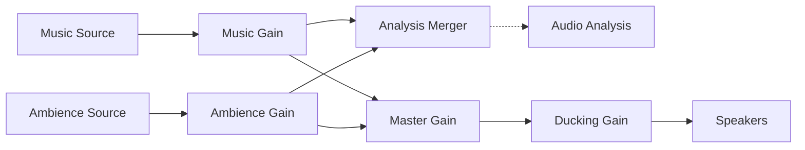

# Synapse Frontend Audio Architecture

## 1. Overview

The Synapse frontend audio system is designed as a modular, tiered architecture that separates low-level audio processing (Web Audio API) from high-level state management (React/Zustand). This ensures that audio playback continues uninterrupted across route changes and provides a high-performance foundation for features like "Smart Flow" (ducking) and "Synesthesia" (visualization).

### Architecture Layers

*   **The Metal Layer via `AudioEngine`**: A Singleton wrapper around the `AudioContext`. Handles the raw node graph, routing, and ducking logic.
*   **The Brain Layer via `useFocusAudioStore`**: A persistent Zustand store that acts as the single source of truth for volume, mix, and playlist state.
*   **The Sensory Layer via `AudioAnalysis`**: A specialized service for FFT analysis and visual signal generation, optimized to run outside the React render cycle.
*   **The Vault Layer via `crateService`**: An IndexedDB abstraction for storing user uploaded audio files locally.

---

## 2. Invariants & Guarantees

### State Flow Direction
State flows *downward* from store → engine for **intent** (volume, mix, playIntent). State flows *upward* from engine → store **only for derived, read-only status** (`isDucked`, `playbackStatus`, `lastError`).

### AudioEngine Lifecycle
- `init()` is idempotent and safe to call multiple times
- `playTrack()` implicitly calls `init()` if context is null
- `resume()` is idempotent
- `suspend()` pauses context but never destroys nodes
- No `destroy()` method exists; engine lives for app lifetime

### BufferSourceNode Contract
Sources are **single-use** (Web Audio API restriction). On play: create new source, connect, start. On stop: stop, disconnect, set to null. Never attempt to reuse a stopped source.

### Decode Cancellation
Long-running decode operations use generation tokens. If superseded by a newer `playTrack()` call, stale operations abort silently.

### Analysis Guarantees
- Performs NO work when subscriber count is 0
- Loop auto-stops when last subscriber unsubscribes
- Energy-gated: pauses after ~2s of silence to save battery
- `requestAnimationFrame` naturally pauses when tab is hidden

### Failure Handling
- Decode/load failures are **non-fatal**
- Errors captured in `lastError` state for observability
- UI can optionally surface errors; system remains stable

### Known Limitations
- `isActuallyPlaying()` checks source existence, not audible gain level
- Ducking profiles are hardcoded; runtime configuration is future work

---

## 3. Core Components

### 3.1 Audio Engine (`modules/focus-audio/engine/AudioEngine.ts`)

The `AudioEngine` is the heart of the system. It implements the Singleton pattern to ensure only one `AudioContext` exists throughout the application lifecycle.

**Key Responsibilities:**
*   **Lazy Initialization**: The `AudioContext` is created only upon the first user interaction to comply with browser autoplay policies.
*   **Graph Management**: Maintains the connection graph of audio nodes.
*   **Ducking System**: Implements a stack-based `duck(reason, profile)` and `restore(reason)` API with configurable profiles.
*   **Buffer Caching**: Decodes and caches `AudioBuffer` objects in memory to prevent re-decoding.
*   **Decode Cancellation**: Uses generation tokens to prevent race conditions during rapid track switching.

**The Audio Graph (Pre-Ducking Analysis Tap):**


> **Rationale**: Analysis tap is placed **before** ducking so visuals reflect true music energy, not ducked output. Ducking is a presentation concern; analysis is a signal concern.

### 3.2 State Management (`modules/focus-audio/store/useFocusAudioStore.ts`)

The state layer uses **Zustand** with the `persist` middleware to save user preferences to `localStorage`.

**State Slice:**
```typescript
interface FocusAudioState {
  // User Intent
  playIntent: boolean;   // User wants audio (renamed from isPlaying)
  
  // Derived Status (Read-only, set by engine)
  playbackStatus: 'idle' | 'loading' | 'playing' | 'paused' | 'error';
  isDucked: boolean;
  lastError: { type: string; message: string; timestamp: number } | null;
  
  // Volume Controls
  volume: number;
  mix: { music: number; ambience: number };
  
  // Track Selection
  activeMusicId: string | null;
  activeAmbienceId: string | null;
}
```

**Intent vs Truth:**
- `playIntent`: User's **desired** state
- `playbackStatus`: **Actual** state from engine
- Use `audioEngine.isActuallyPlaying()` for definitive truth

### 3.3 Audio Analysis (`modules/focus-audio/engine/AudioAnalysis.ts`)

This service powers the visualizers without clogging the main thread.

*   **FFT Analysis**: Uses an `AnalyserNode` with `fftSize=256` (128 frequency bins)
*   **Frequency Bands**: Bass (0-344Hz), Mids (500Hz-3.4kHz), Treble (3.6kHz+)
*   **Throttling**: ~15fps emission rate
*   **Energy Gating**: Pauses after ~2s of silence to save battery

### 3.4 Crate Service (`modules/focus-audio/services/crateService.ts`)

Handles persistence of custom user audio tracks using **IndexedDB**.

*   **Database**: `synapse-audio-crate` (Version 1)
*   **Stores**: `tracks` (metadata), `blobs` (binary data)
*   **Track Deletion**: Automatically stops playback if deleted track is currently playing

---

## 4. Key Features

### 4.1 Smart Flow (Auto-Ducking with Profiles)

**Ducking Profiles:**
| Profile | Strength | Ramp Time | Use Case |
|---------|----------|-----------|----------|
| `media` | 15% | 0.8s | Video, external audio |
| `speech` | 25% | 0.5s | TTS, narration |
| `alert` | 40% | 0.3s | Notifications |

**Logic:**
1. Component calls `audioEngine.duck('video-player', 'media')`
2. Reason + profile added to ducking stack (Map)
3. Engine finds most aggressive profile and ramps to that level
4. On `restore('video-player')`, reason removed; recalculates target

### 4.2 Synesthesia (Visual Integration)

The `useAudioSignals` hook bridges `AudioAnalysis` signals into React state:

```typescript
export function useAudioSignals() {
  const { synesthesiaEnabled, playIntent } = useFocusAudioStore();
  
  useEffect(() => {
    if (!synesthesiaEnabled || !playIntent) return;
    return audioAnalysis.subscribe(setSignals);
  }, [synesthesiaEnabled, playIntent]);
  
  return signals; // { energy, bass, mids, treble }
}
```

---

## 5. Initialization Flow

1. **App Load**: Stores hydrated from localStorage. `AudioEngine` instantiated but suspended.
2. **First Click (Play)**: `AudioEngine.init()` called, `AudioContext` resumes, graph constructed.
3. **Track Loading**: Fetched via URL or retrieved from IndexedDB crate.
4. **Decoding**: Decoded to `AudioBuffer`, cached in memory, cancellable via generation token.
5. **Playback**: New `AudioBufferSourceNode` created (single-use), connected, started.

