# 00 — Architectural Mapping: Paperless-ngx → Synapse

> **Goal**: Map every Paperless-ngx subsystem to its Synapse equivalent, identifying gaps, existing infrastructure, and adaptation strategy.

---

## Master Architecture Map

```mermaid
graph TB
    subgraph "Paperless-ngx Architecture"
        P_ING["Ingestion<br>consumer.py (861)"]
        P_PAR["Parsers<br>4 types, weight registry"]
        P_OCR["OCR<br>Tesseract + OCRmyPDF"]
        P_CLASS["Classification<br>classifier.py (547)"]
        P_MATCH["Matching<br>matching.py (647)"]
        P_IDX["Indexing<br>Whoosh (618)"]
        P_WF["Workflows<br>Trigger-Action (600+)"]
        P_PERM["Permissions<br>django-guardian"]
        P_STORE["Storage<br>Dual-path + templates"]
        P_MAIL["Mail<br>IMAP/POP3 (13 files)"]
        P_BAR["Barcodes<br>barcodes.py (497)"]
        P_SIG["Signals<br>handlers.py (1546)"]
        P_TASK["Tasks<br>tasks.py (566)"]
        P_CF["Custom Fields<br>EAV (10 types)"]
        P_AUDIT["Audit<br>auditlog"]
    end

    subgraph "Synapse Current"
        S_UPL["Upload<br>service.py (343)"]
        S_PROC["Processing<br>3 paths (768 total)"]
        S_OCR["OCR<br>processor.py (488)"]
        S_TAG["Tags<br>tag.py (62) ORPHANED"]
        S_SRCH["Search<br>PG FTS chunks only"]
        S_AI["AI<br>Gemini + Qdrant"]
        S_STORE["Storage<br>Single UUID path"]
        S_TASK["Tasks<br>ocr_tasks.py"]
    end

    P_ING -.->|"Gap: Plugin pipeline"| S_UPL
    P_PAR -.->|"Gap: Unified interface"| S_PROC
    P_OCR -.->|"✅ Strong match"| S_OCR
    P_CLASS -.->|"Gap: No ML classifier"| S_AI
    P_MATCH -.->|"Gap: No matching engine"| S_TAG
    P_IDX -.->|"Gap: Document-level index"| S_SRCH
    P_WF -.->|"Gap: Not implemented"| S_UPL
    P_PERM -.->|"Gap: user_id only"| S_UPL
    P_STORE -.->|"Gap: No archive path"| S_STORE
    P_MAIL -.->|"Gap: Not implemented"| S_UPL
    P_TASK -.->|"Partial match"| S_TASK
```

---

## Subsystem-by-Subsystem Mapping

### 1. Ingestion Pipeline

| Component | Paperless | Synapse | Gap | Strategy |
|---|---|---|---|---|
| **Entry points** | 4 sources (folder, API, email, web) | 1 (API upload only) | 3 missing sources | Add watched folder + mail ingestion |
| **Pipeline** | Plugin chain: Preflight → Workflow → Barcode → Consumer | Flat: validate → save → process | No plugin architecture | Implement `IngestionPlugin` ABC |
| **Validation** | `ConsumerPreflightPlugin` — file exists, dirs ok, ASN unique, dedup | `validate_file()` — extension check only | Limited validation | Expand to full preflight |
| **MIME detection** | `python-magic` from bytes | Extension string check | Unreliable for renamed files | Adopt python-magic |
| **Progress** | WebSocket per-step (0→100%) | Status enum (pending/processing/completed/failed) | No granular progress | Add WebSocket progress |
| **Error recovery** | qpdf PDF repair, safe fallback mode | Exception → FAILED status | No recovery | Add fallback mechanisms |
| **Pre/post scripts** | Configurable shell hooks | Not implemented | Missing | Phase 4 consideration |

**Key Paperless files**: `consumer.py` (861), `data_models.py` (176)
**Key Synapse files**: `services/document/service.py` (343), `modules/documents/service.py` (191)

---

### 2. OCR & Parsing System

| Component | Paperless | Synapse | Gap | Strategy |
|---|---|---|---|---|
| **Parser interface** | `DocumentParser` base class (407 lines) | 3 separate implementations | No unified interface | Create `BaseDocumentParser` ABC |
| **Registry** | Weight-based MIME → parser (`get_parser_class_for_mime_type`) | `if/elif` on extension | No registry | Implement weighted registry |
| **PDF parsing** | OCRmyPDF (Tesseract + Ghostscript) | PyPDF2 + pypdf + PyMuPDF + pdfplumber (**4 libs!**) | Fragmentation | Unify on pypdf + OcrProcessor |
| **Office docs** | Apache Tika (server-based) + Gotenberg | python-docx only | No spreadsheet/slides/ODT | Evaluate Tika vs python-based |
| **Text files** | `TextDocumentParser` (51 lines) | `_extract_txt()` (14 lines) | ✅ Adequate | Wrap in parser interface |
| **Archive output** | Every parser produces PDF/A | No archive generation | Missing | Add PDF/A conversion step |
| **Thumbnails** | ImageMagick → GhostScript fallback | Pillow-based | ✅ Adequate | Standardize to parser output |
| **Date extraction** | Regex from content + filename (14 formats) | Not implemented | Missing | Add date parser |
| **Metadata** | Parser-level extraction | Partial (pypdf, docx only) | Incomplete | Standardize in parser interface |

**Key Paperless files**: `documents/parsers.py` (407), `paperless_tesseract/parsers.py` (473), `paperless_tika/parsers.py` (137), `paperless_text/parsers.py` (51)
**Key Synapse files**: `modules/documents/processing.py` (297), `services/background/document_processor.py` (388), `core/ai/rag/ingestion/parsers/pdf_parser.py` (83), `services/ocr/processor.py` (488)

---

### 3. Document Classification & Tagging

| Component | Paperless | Synapse | Gap | Strategy |
|---|---|---|---|---|
| **Tag model** | `MatchingModel` + `TreeNodeModel`, 7 matching algorithms | Standalone 62-line model, no document link | **No document↔tag M2M** | Create join table, expand Tag model |
| **Correspondent** | Full model with matching | Not implemented | **Missing entirely** | Create Correspondent model |
| **DocumentType** | Full model with matching | `sector` free-text field | Weak substitute | Create DocumentType model |
| **StoragePath** | Full model with matching + Jinja2 templates | UUID flat path | No templates | Create StoragePath model |
| **ML classifier** | scikit-learn MLPClassifier (547 lines) | Not implemented | Missing | Use Gemini for zero-shot classification |
| **Rule matching** | 7 algorithms (none/any/all/literal/regex/fuzzy/auto) | 8 hardcoded biology keywords | **Extremely limited** | Implement MatchingModel base |
| **Auto-assignment** | Signal chain after consumption | Not implemented | Missing | Add post-consumption signals |
| **Tag hierarchy** | TreeNodeModel, max depth 5 | Flat tags | No nesting | Add parent_id + depth validation |
| **Inbox tags** | `is_inbox_tag` auto-applied flag | Not implemented | Missing | Add inbox tag system |

**Key Paperless files**: `classifier.py` (547), `matching.py` (647), `signals/handlers.py` (1546)
**Key Synapse files**: `models/tag.py` (62), `core/ai/rag/metadata/topic_tagger.py` (131)

---

### 4. Search & Indexing

| Component | Paperless | Synapse | Gap | Strategy |
|---|---|---|---|---|
| **Search engine** | Whoosh (dedicated FTS, 35-field schema) | PostgreSQL `to_tsvector` on chunks | Chunk-only, no metadata search | Build document-level GIN index |
| **Searchable fields** | title, content, correspondent, tag, type, notes, custom_fields, filename, ASN, owner | chunk.content only | 9+ fields missing | Extend tsvector to document table |
| **Saved views** | `SavedView` + `SavedViewFilterRule` (48 types) | Not implemented | Missing | Create SavedView model |
| **Similarity search** | Whoosh "More Like This" | Qdrant vector similarity | ✅ Already superior | Keep and integrate |
| **Filter combinations** | AND/OR across all metadata | user_id + optional doc_ids | Very limited | Build filter expression engine |
| **Permission filtering** | BitSet intersection with ACL queryset | `user_id = :user_id` WHERE | No sharing-aware search | Integrate with permission model |

**Key Paperless files**: `index.py` (618)
**Key Synapse files**: `modules/documents/repository.py` (237)

---

### 5. Permission & Access Control

| Component | Paperless | Synapse | Gap | Strategy |
|---|---|---|---|---|
| **Access model** | 3-tier: model + object ACL + ownership | `user_id` column filter | **No sharing** | Implement ACL system |
| **Object perms** | django-guardian per-document view/change | Not implemented | Missing | Build lightweight ACL |
| **Group perms** | Guardian group object perms | Not implemented | Missing | Add group support |
| **Share links** | `ShareLink` model (expiring slug) | Not implemented | Missing | Create ShareLink model |
| **Admin access** | `PaperlessAdminPermissions` | Not implemented | Missing | Add admin role |

**Key Paperless files**: `permissions.py` (223)
**Key Synapse files**: None — only `user_id` in WHERE clauses

---

### 6. Storage Architecture

| Component | Paperless | Synapse | Gap | Strategy |
|---|---|---|---|---|
| **File versions** | 2 (original + PDF/A archive) | 1 (original only) | No archive | Add archive path |
| **Archive format** | PDF/A with embedded OCR | Not implemented | Missing | Generate PDF/A via OCRmyPDF |
| **File naming** | StoragePath Jinja2 templates | UUID prefix | No templates | Add template system |
| **Auto-rename** | Signal on metadata change | Not implemented | Missing | Add signal handler |
| **Checksum verify** | `sanity_check` task | SHA-256 at upload only | No ongoing verification | Add periodic sanity check |
| **Encryption** | GPG support | Not implemented | Phase 4 | Evaluate need |

**Key Paperless files**: `consumer.py` _store method, `signals/handlers.py` update_filename_and_move_files
**Key Synapse files**: `services/document/service.py` generate_upload_path

---

### 7. Workflow & Automation

| Component | Paperless | Synapse | Gap | Strategy |
|---|---|---|---|---|
| **Engine** | Full trigger-action model | **Not implemented** | **Entirely missing** | Build from scratch |
| **Triggers** | 4 types (consumption, added, updated, scheduled) | None | Missing | Implement trigger model |
| **Actions** | 4 types (assign, remove, email, webhook) | None | Missing | Implement action model |
| **Execution log** | `WorkflowRun` audit | None | Missing | Add WorkflowRun model |
| **Scheduling** | `check_scheduled_workflows` Celery task | None | Missing | Add periodic task |

**Key Paperless files**: `models.py` lines 980-1583 (600+ lines)

---

### 8. Metadata & Custom Fields

| Component | Paperless | Synapse | Gap | Strategy |
|---|---|---|---|---|
| **Custom fields** | EAV: `CustomField` + `CustomFieldInstance` (10 data types) | `file_metadata` JSONB blob | No structured fields | Implement EAV pattern |
| **Field types** | String, URL, Date, Boolean, Integer, Float, Monetary, DocLink, Select, LongText | Unstructured JSON | No type validation | Define CustomField model |
| **Notes** | `Note` model (FK to Document, soft delete) | `notes` text column on Document | No structured notes | Create Note model |

**Key Paperless files**: `models.py` lines 780-964

---

### 9. Mail & Watched Folder Ingestion

| Component | Paperless | Synapse | Gap | Strategy |
|---|---|---|---|---|
| **Mail** | IMAP/POP3 + OAuth2 (13 files) | Not implemented | Phase 4 | Defer to later |
| **Watched folder** | Filesystem watcher + auto-import | Not implemented | Phase 4 | Defer to later |
| **Web upload** | Django form + DRF endpoint | FastAPI endpoint ✅ | Adequate | Keep current |

---

### 10. Thumbnailing & Document Rendering

| Component | Paperless | Synapse | Gap | Strategy |
|---|---|---|---|---|
| **Generation** | ImageMagick → GhostScript fallback | Pillow-based | ✅ Adequate for now | Integrate into parser output |
| **Storage** | Dedicated `THUMBNAIL_DIR` | Alongside uploads | Unorganized | Create thumbnail directory |
| **Format** | WebP | Various | Standardize to WebP | Enforce WebP output |
| **Viewing** | Basic PDF web viewer | **7-format viewer** (PDF, DOCX, EPUB, Spreadsheet, TXT, MD, HTML) | ✅ **Synapse is superior** | Keep and extend |

---

### 11. Archival Format Handling (PDF/A)

| Component | Paperless | Synapse | Gap | Strategy |
|---|---|---|---|---|
| **PDF/A generation** | OCRmyPDF `output_type` param → PDF/A-1, A-2, A-3 | Not implemented | Missing | Leverage existing OcrProcessor |
| **OCR text layer** | Embedded in archive PDF | Not implemented | Missing | OCRmyPDF already does this |
| **Office → PDF/A** | Gotenberg (LibreOffice wrapper) | Not implemented | Missing | Evaluate Gotenberg vs local conversion |

---

### 12. Background Task Systems

| Component | Paperless | Synapse | Gap | Strategy |
|---|---|---|---|---|
| **Framework** | Celery (shared_task) | Celery ✅ | ✅ Match | Extend existing |
| **OCR task** | Part of consumer pipeline | `ocr.process_document` ✅ | ✅ Good | Already implemented |
| **Classifier training** | `train_classifier` periodic task | Not implemented | Missing | Add AI classification task |
| **Index optimization** | `index_optimize` periodic | Not implemented | Missing | Add index maintenance |
| **Sanity check** | `sanity_check` on-demand + scheduled | Not implemented | Missing | Add file integrity check |
| **Trash cleanup** | `empty_trash` task | Not implemented | Missing | Add trash cleanup |

**Key Paperless files**: `tasks.py` (566)
**Key Synapse files**: `services/background/ocr_tasks.py`

---

### 13. Audit Logging

| Component | Paperless | Synapse | Gap | Strategy |
|---|---|---|---|---|
| **Library** | `django-auditlog` registered on 7 models | Not implemented | Missing | Evaluate SQLAlchemy audit options |
| **M2M tracking** | Tags M2M changes logged | Not implemented | Missing | Add to audit system |

---

### 14. Document Numbering / ASN

| Component | Paperless | Synapse | Gap | Strategy |
|---|---|---|---|---|
| **ASN** | `archive_serial_number` — unique, sequential, 0–0xFFFFFFFF | Not implemented | Missing | Add ASN field to Document |
| **Barcode ASN** | Extract from barcode → set ASN | Not implemented | Phase 4 | Defer |

---

### 15. Share Links and External Access

| Component | Paperless | Synapse | Gap | Strategy |
|---|---|---|---|---|
| **Share model** | `ShareLink` — expiring slug, FK to Document | Not implemented | Missing | Create ShareLink model |
| **Public view** | `SharedLinkView` — serves document without auth | Not implemented | Missing | Add public endpoint |
| **Expiration** | `expiration` DateTimeField | Not implemented | Missing | Add TTL logic |

---

## Architecture Gap Summary

| Priority | Gap | Impact | Effort |
|---|---|---|---|
| 🔴 Critical | Tag↔Document M2M missing | Blocks all classification | Low |
| 🔴 Critical | Three fragmented parser paths | Inconsistent text extraction | Medium |
| 🔴 Critical | No document-level search index | Cannot search by metadata | Medium |
| 🟠 High | No MatchingModel / classification | No auto-organization | Medium |
| 🟠 High | No workflow engine | No automation | High |
| 🟠 High | No archive format (PDF/A) | No long-term archival | Medium |
| 🟡 Medium | No object-level permissions | No sharing | Medium |
| 🟡 Medium | No Correspondent/DocumentType models | No structured classification | Low |
| 🟢 Low | No mail ingestion | Limited input sources | High |
| 🟢 Low | No barcode detection | Niche feature | Medium |
| 🟢 Low | No ASN numbering | Niche feature | Low |
