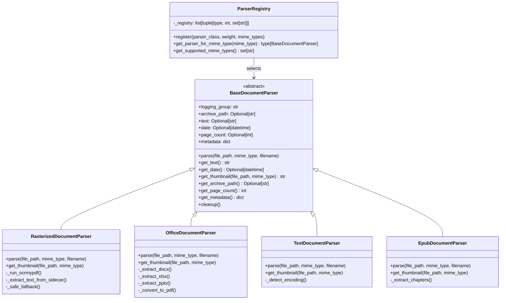
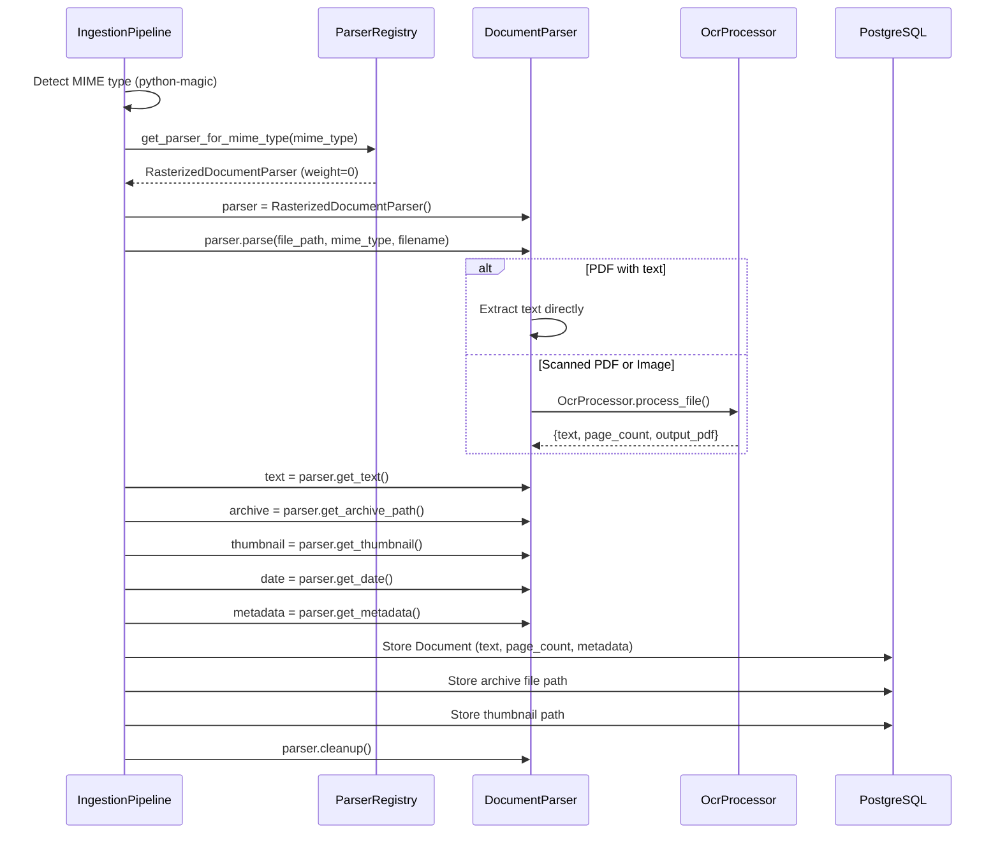

# 01 — Parser & Text Extraction Unification

> **Goal**: Replace Synapse's 3 fragmented text extraction paths with a unified `DocumentParser` architecture inspired by Paperless-ngx's parser registry.

---

## Problem Statement

Synapse currently has **three independent extraction implementations**:

| Path | File | Library | Used By |
|---|---|---|---|
| Path 1 | `modules/documents/processing.py` (297 lines) | PyPDF2 → pdfplumber fallback | `DocumentService.process_document()` |
| Path 2 | `services/background/document_processor.py` (388 lines) | pypdf + OCR fallback | Background processing tasks |
| Path 3 | `core/ai/rag/ingestion/parsers/pdf_parser.py` (83 lines) | PyMuPDF (fitz) | RAG pipeline |

The same PDF processed through different paths may yield **different extracted text**. There is no shared interface, no consistent metadata extraction, and no archive generation.

**Paperless solution**: One `DocumentParser` base class, one parser per MIME group, selected via a weight-based registry.

---

## Target Architecture



---

## Module Structure

```
backend/app/services/parsers/
├── __init__.py                 # Exports: ParserRegistry, get_parser
├── base.py                     # BaseDocumentParser ABC
├── registry.py                 # ParserRegistry (weight-based MIME lookup)
├── rasterized.py               # RasterizedDocumentParser (PDF + images via OCR)
├── office.py                   # OfficeDocumentParser (DOCX, XLSX, PPTX, ODT)
├── text.py                     # TextDocumentParser (TXT, CSV, MD)
├── epub.py                     # EpubDocumentParser (EPUB)
└── utils.py                    # Shared: date parsing, thumbnail, metadata
```

---

## BaseDocumentParser Interface

```python
# backend/app/services/parsers/base.py

import abc
import tempfile
from datetime import datetime
from pathlib import Path
from typing import Optional


class BaseDocumentParser(abc.ABC):
    """
    Base class for all document parsers.

    Every parser implements parse() which extracts text, generates an
    archive PDF (if applicable), and extracts metadata. Lifecycle:

        parser = SomeParser()
        parser.parse(file_path, mime_type, filename)
        text = parser.get_text()
        archive = parser.get_archive_path()     # PDF/A with OCR layer
        thumb = parser.get_thumbnail(file_path, mime_type)
        date = parser.get_date()
        metadata = parser.get_metadata()
        parser.cleanup()
    """

    def __init__(self, logging_group: str = ""):
        self.logging_group = logging_group
        self._text: Optional[str] = None
        self._date: Optional[datetime] = None
        self._archive_path: Optional[str] = None
        self._page_count: Optional[int] = None
        self._metadata: dict = {}
        self._tempdir: Optional[str] = None

    @property
    def tempdir(self) -> str:
        if self._tempdir is None:
            self._tempdir = tempfile.mkdtemp(prefix="synapse_parser_")
        return self._tempdir

    @abc.abstractmethod
    def parse(self, file_path: str, mime_type: str, filename: str) -> None:
        """
        Parse the document. Must populate:
        - self._text (extracted text)
        - self._archive_path (path to PDF/A if generated)
        - self._date (document date if extractable)
        - self._page_count
        - self._metadata
        """
        ...

    def get_text(self) -> str:
        return self._text or ""

    def get_date(self) -> Optional[datetime]:
        return self._date

    def get_archive_path(self) -> Optional[str]:
        return self._archive_path

    def get_page_count(self) -> int:
        return self._page_count or 0

    def get_metadata(self) -> dict:
        return self._metadata

    @abc.abstractmethod
    def get_thumbnail(self, file_path: str, mime_type: str) -> Optional[str]:
        """Generate thumbnail, return path to thumbnail file."""
        ...

    def cleanup(self):
        """Remove temporary files."""
        if self._tempdir:
            import shutil
            shutil.rmtree(self._tempdir, ignore_errors=True)
            self._tempdir = None
```

---

## Parser Registry

```python
# backend/app/services/parsers/registry.py

from typing import Type, Optional
import logging

from .base import BaseDocumentParser

logger = logging.getLogger(__name__)


class ParserRegistry:
    """
    Weight-based parser registry.

    Parsers register with a weight + set of MIME types.
    Lower weight = higher priority. When multiple parsers
    handle the same MIME type, the lowest-weight parser wins.

    Usage:
        registry = ParserRegistry()
        registry.register(RasterizedDocumentParser, weight=0,
                          mime_types={"application/pdf", "image/jpeg", ...})
        registry.register(OfficeDocumentParser, weight=10,
                          mime_types={"application/vnd.openxmlformats-...", ...})

        parser_class = registry.get_parser_for_mime_type("application/pdf")
        parser = parser_class()
        parser.parse(file_path, mime_type, filename)
    """

    def __init__(self):
        # List of (parser_class, weight, mime_types)
        self._registry: list[tuple[Type[BaseDocumentParser], int, set[str]]] = []

    def register(
        self,
        parser_class: Type[BaseDocumentParser],
        weight: int,
        mime_types: set[str],
    ):
        """Register a parser with weight and supported MIME types."""
        self._registry.append((parser_class, weight, mime_types))
        self._registry.sort(key=lambda x: x[1])  # Keep sorted by weight
        logger.info(
            f"Registered {parser_class.__name__} "
            f"(weight={weight}, types={len(mime_types)})"
        )

    def get_parser_for_mime_type(
        self, mime_type: str
    ) -> Optional[Type[BaseDocumentParser]]:
        """Return the lowest-weight parser that handles this MIME type."""
        for parser_class, weight, mime_types in self._registry:
            if mime_type in mime_types:
                return parser_class
        return None

    def get_supported_mime_types(self) -> set[str]:
        """Return all registered MIME types."""
        all_types = set()
        for _, _, mime_types in self._registry:
            all_types |= mime_types
        return all_types


# Global registry instance
_registry = ParserRegistry()


def get_parser_registry() -> ParserRegistry:
    return _registry


def get_parser_for_mime_type(mime_type: str) -> Optional[Type[BaseDocumentParser]]:
    return _registry.get_parser_for_mime_type(mime_type)
```

---

## Parser Implementations

### RasterizedDocumentParser (Weight: 0)

Handles PDFs and images via OCR. This wraps **Synapse's existing `OcrProcessor`** (488 lines) which is already a solid implementation modeled after Paperless.

```python
# backend/app/services/parsers/rasterized.py

SUPPORTED_MIME_TYPES = {
    "application/pdf",
    "image/jpeg", "image/png", "image/tiff", "image/bmp",
    "image/gif", "image/webp",
}
WEIGHT = 0  # Highest priority for PDFs

class RasterizedDocumentParser(BaseDocumentParser):
    """
    PDF + image parser using OCRmyPDF / Tesseract.

    Wraps Synapse's existing OcrProcessor and adds:
    - Archive PDF/A generation (via OCRmyPDF output_type)
    - Sidecar text extraction
    - Safe fallback on OCR failure
    - Date extraction from content
    """

    def parse(self, file_path, mime_type, filename):
        from app.services.ocr import OcrProcessor, OcrConfig
        from app.services.parsers.utils import parse_date_from_text

        with OcrProcessor() as processor:
            result = processor.process_file(file_path, mime_type)

            self._text = result.get("text", "")
            self._page_count = result.get("page_count")
            self._archive_path = result.get("output_pdf")  # PDF/A output

            # Extract metadata from PDF
            if processor.is_pdf(mime_type):
                self._metadata = self._extract_pdf_metadata(file_path)

        # Date extraction from content + filename
        self._date = parse_date_from_text(self._text, filename)

    def get_thumbnail(self, file_path, mime_type):
        from app.services.document.service import generate_thumbnail
        return generate_thumbnail(file_path, mime_type)
```

**Required change to `OcrProcessor`**: Extend `process_file()` to return `output_pdf` path (the PDF/A archive). Currently it returns `text`, `page_count`, `method` — need to also return the OCRmyPDF output file path.

### OfficeDocumentParser (Weight: 10)

```python
# backend/app/services/parsers/office.py

SUPPORTED_MIME_TYPES = {
    "application/vnd.openxmlformats-officedocument.wordprocessingml.document",   # DOCX
    "application/vnd.openxmlformats-officedocument.spreadsheetml.sheet",         # XLSX
    "application/vnd.openxmlformats-officedocument.presentationml.presentation", # PPTX
    "application/vnd.oasis.opendocument.text",                                   # ODT
    "application/rtf",                                                            # RTF
}
WEIGHT = 10

class OfficeDocumentParser(BaseDocumentParser):
    """
    Office document parser using python-docx/openpyxl/python-pptx.

    Approach:
    - Extract text from native format (python-docx, openpyxl, python-pptx)
    - Generate PDF/A via LibreOffice CLI (soffice --convert-to pdf)
    - Generate thumbnail from converted PDF
    """

    def parse(self, file_path, mime_type, filename):
        from app.services.parsers.utils import parse_date_from_text

        if "wordprocessing" in mime_type or "opendocument.text" in mime_type:
            self._text, self._metadata = self._extract_docx(file_path)
        elif "spreadsheet" in mime_type:
            self._text, self._metadata = self._extract_xlsx(file_path)
        elif "presentation" in mime_type:
            self._text, self._metadata = self._extract_pptx(file_path)
        else:
            self._text = self._extract_generic(file_path)

        # Generate archive PDF via LibreOffice
        self._archive_path = self._convert_to_pdf(file_path)
        self._date = parse_date_from_text(self._text, filename)
```

### TextDocumentParser (Weight: 10)

```python
# backend/app/services/parsers/text.py

SUPPORTED_MIME_TYPES = {
    "text/plain",
    "text/csv",
    "text/markdown",
    "text/x-markdown",
}
WEIGHT = 10

class TextDocumentParser(BaseDocumentParser):
    """
    Plain text parser with encoding detection.

    No archive generation (text files don't need PDF/A).
    """

    def parse(self, file_path, mime_type, filename):
        content = self._read_with_fallback(file_path)
        self._text = content
        self._page_count = 1
```

### EpubDocumentParser (Weight: 10)

```python
# backend/app/services/parsers/epub.py

SUPPORTED_MIME_TYPES = {"application/epub+zip"}
WEIGHT = 10

class EpubDocumentParser(BaseDocumentParser):
    """
    EPUB parser using ebooklib + BeautifulSoup.
    """

    def parse(self, file_path, mime_type, filename):
        import ebooklib
        from ebooklib import epub
        from bs4 import BeautifulSoup

        book = epub.read_epub(file_path)
        text_parts = []
        for item in book.get_items():
            if item.get_type() == ebooklib.ITEM_DOCUMENT:
                soup = BeautifulSoup(item.get_content(), 'html.parser')
                text_parts.append(soup.get_text())

        self._text = "\n\n".join(text_parts)
        self._metadata = {
            "title": book.get_metadata("DC", "title"),
            "author": book.get_metadata("DC", "creator"),
        }
```

---

## Parser Lifecycle Flow



---

## Migration from Current System

### Files to Deprecate

| Current File | Lines | Replacement |
|---|---|---|
| `modules/documents/processing.py` | 297 | `services/parsers/` (all parsers) |
| `services/background/document_processor.py` | 388 | `services/parsers/` + consumer pipeline |
| `core/ai/rag/ingestion/parsers/pdf_parser.py` | 83 | `services/parsers/rasterized.py` |

### Files to Extend

| File | Change |
|---|---|
| `services/ocr/processor.py` (488) | Return `output_pdf` path from `process_file()` |
| `services/document/service.py` (343) | Use `ParserRegistry` instead of inline extraction |
| `modules/documents/service.py` (191) | Replace `extract_text()` call with parser dispatch |

### Backward Compatibility

During migration, the existing `processing.py` functions remain available. The `DocumentService.process_document()` is updated to use the parser registry but falls back to the old `extract_text()` if no parser matches.

---

## Date Extraction Utility

Paperless extracts dates from document content using 14+ regex patterns and from filenames. This utility should be implemented in `services/parsers/utils.py`:

```python
# backend/app/services/parsers/utils.py

import re
from datetime import datetime
from typing import Optional

# Date patterns (ordered by specificity)
DATE_PATTERNS = [
    # ISO format: 2024-01-15
    (r"\b(\d{4})-(\d{1,2})-(\d{1,2})\b", "%Y-%m-%d"),
    # US format: 01/15/2024
    (r"\b(\d{1,2})/(\d{1,2})/(\d{4})\b", "%m/%d/%Y"),
    # European: 15.01.2024
    (r"\b(\d{1,2})\.(\d{1,2})\.(\d{4})\b", "%d.%m.%Y"),
    # Written: January 15, 2024
    (r"\b(January|February|March|April|May|June|July|August|"
     r"September|October|November|December)\s+(\d{1,2}),?\s+(\d{4})\b", None),
    # Filename date: 20240115, 2024_01_15
    (r"\b(\d{4})[_-]?(\d{2})[_-]?(\d{2})\b", None),
]


def parse_date_from_text(text: str, filename: str = "") -> Optional[datetime]:
    """
    Extract the most likely document date from content and filename.

    Priority: 1) filename dates, 2) content dates (first occurrence)
    """
    # Try filename first
    for pattern, fmt in DATE_PATTERNS:
        match = re.search(pattern, filename)
        if match:
            try:
                return _parse_match(match, fmt)
            except (ValueError, IndexError):
                continue

    # Then content (first 5000 chars to avoid noise)
    search_text = text[:5000] if text else ""
    for pattern, fmt in DATE_PATTERNS:
        match = re.search(pattern, search_text)
        if match:
            try:
                return _parse_match(match, fmt)
            except (ValueError, IndexError):
                continue

    return None
```

---

## Engineering Tasks

1. **Create `services/parsers/` module** with `base.py`, `registry.py`
2. **Implement `RasterizedDocumentParser`** — wrap existing `OcrProcessor`
3. **Implement `OfficeDocumentParser`** — consolidate DOCX extraction, add XLSX/PPTX
4. **Implement `TextDocumentParser`** — wrap existing text extraction
5. **Implement `EpubDocumentParser`** — wrap existing epub extraction
6. **Implement `ParserRegistry`** with weight-based selection
7. **Extend `OcrProcessor.process_file()`** to return archive PDF path
8. **Implement date extraction utility** in `utils.py`
9. **Add MIME detection** via `python-magic` to consumer pipeline
10. **Update `DocumentService`** to use parser registry
11. **Update RAG pipeline** to use parser registry instead of `PDFParser`
12. **Write tests** for each parser type
13. **Deprecate** old extraction files once migration is verified
