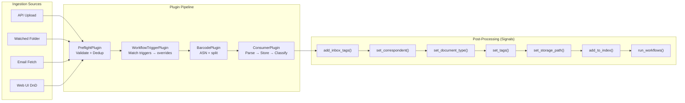

# 02 — Ingestion Pipeline Architecture

> **Goal**: Replace Synapse's flat `upload → process` flow with a plugin-based consumer pipeline inspired by Paperless-ngx's `consumer.py`.

---

## Current vs Target

### Current Synapse Flow

```
API Upload → validate_file() → save_uploaded_file() → trigger_document_processing()
                                                              ↓
                                                    Celery: extract_text → chunk → embed
```

Single entry point, no extensibility, no pre-processing hooks.

### Target Architecture



---

## Plugin Interface

```python
# backend/app/services/ingestion/base.py

import abc
from dataclasses import dataclass, field
from typing import Optional
from datetime import datetime


@dataclass
class ConsumableDocument:
    """Represents a document entering the ingestion pipeline."""
    source_path: str
    original_filename: str
    mime_type: Optional[str] = None
    source: str = "api_upload"  # api_upload, watched_folder, mail, web_ui

    # Metadata overrides (populated by workflow triggers)
    overrides: "DocumentMetadataOverrides" = field(
        default_factory=lambda: DocumentMetadataOverrides()
    )


@dataclass
class DocumentMetadataOverrides:
    """
    Metadata overrides applied during ingestion.
    Populated by workflow triggers and user input.
    """
    title: Optional[str] = None
    correspondent_id: Optional[int] = None
    document_type_id: Optional[int] = None
    tag_ids: list[int] = field(default_factory=list)
    storage_path_id: Optional[int] = None
    owner_id: Optional[int] = None
    created_date: Optional[datetime] = None
    asn: Optional[int] = None


class IngestionPlugin(abc.ABC):
    """
    Base class for ingestion pipeline plugins.

    Each plugin runs in sequence. If able_to_run() returns False,
    the plugin is skipped. If run() raises, the pipeline aborts
    and cleanup() is called on all previously-run plugins.
    """

    def __init__(self, consumable: ConsumableDocument, status_callback=None):
        self.consumable = consumable
        self.status_callback = status_callback

    def able_to_run(self) -> bool:
        """Return False to skip this plugin."""
        return True

    def setup(self):
        """Prepare for execution (acquire resources, etc.)."""
        pass

    @abc.abstractmethod
    def run(self):
        """Execute the plugin logic. Must be overridden."""
        ...

    def cleanup(self):
        """Release resources. Called even on failure."""
        pass

    def report_progress(self, progress: int, message: str = ""):
        """Report progress 0-100 to the status callback."""
        if self.status_callback:
            self.status_callback(progress, message)
```

---

## Pipeline Runner

```python
# backend/app/services/ingestion/pipeline.py

import logging
from typing import Type

from .base import IngestionPlugin, ConsumableDocument

logger = logging.getLogger(__name__)


class IngestionPipeline:
    """
    Orchestrates plugin execution in sequence.

    Usage:
        pipeline = IngestionPipeline(consumable, [
            PreflightPlugin,
            WorkflowTriggerPlugin,
            BarcodePlugin,
            ConsumerPlugin,
        ])
        pipeline.run()
    """

    def __init__(
        self,
        consumable: ConsumableDocument,
        plugin_classes: list[Type[IngestionPlugin]],
        status_callback=None,
    ):
        self.consumable = consumable
        self.status_callback = status_callback
        self.plugins: list[IngestionPlugin] = []
        self._executed: list[IngestionPlugin] = []

        # Instantiate plugins
        for plugin_cls in plugin_classes:
            plugin = plugin_cls(consumable, status_callback)
            self.plugins.append(plugin)

    def run(self) -> int:
        """
        Run all plugins in sequence.

        Returns:
            Document ID of the consumed document.

        Raises:
            IngestionError: If any plugin fails critically.
        """
        try:
            for plugin in self.plugins:
                if not plugin.able_to_run():
                    logger.info(f"Skipping {plugin.__class__.__name__}")
                    continue

                logger.info(f"Running {plugin.__class__.__name__}")
                plugin.setup()
                self._executed.append(plugin)
                plugin.run()

        except Exception as e:
            logger.error(f"Pipeline failed: {e}")
            self._cleanup_all()
            raise

        # Return document ID from the consumer plugin
        consumer = self._get_consumer()
        return consumer.document_id if consumer else None

    def _cleanup_all(self):
        for plugin in reversed(self._executed):
            try:
                plugin.cleanup()
            except Exception as e:
                logger.warning(f"Cleanup failed for {plugin.__class__.__name__}: {e}")

    def _get_consumer(self):
        from .plugins.consumer import ConsumerPlugin
        for p in self._executed:
            if isinstance(p, ConsumerPlugin):
                return p
        return None
```

---

## Plugin Implementations

### PreflightPlugin

```python
# backend/app/services/ingestion/plugins/preflight.py

import hashlib
import os

from app.services.ingestion.base import IngestionPlugin


class PreflightPlugin(IngestionPlugin):
    """
    Validate incoming document before processing.

    Checks:
    1. File exists and is readable
    2. File size within limits
    3. MIME type detection (python-magic)
    4. Duplicate detection via MD5/SHA-256 checksum
    5. Filename sanitization
    """

    def run(self):
        self.report_progress(5, "Validating document...")

        # 1. File exists
        if not os.path.isfile(self.consumable.source_path):
            raise IngestionError(f"File not found: {self.consumable.source_path}")

        # 2. File size
        size = os.path.getsize(self.consumable.source_path)
        if size > MAX_FILE_SIZE:
            raise IngestionError(f"File too large: {size} bytes")
        if size == 0:
            raise IngestionError("Empty file")

        # 3. MIME detection
        import magic
        self.consumable.mime_type = magic.from_file(
            self.consumable.source_path, mime=True
        )

        # 4. Duplicate check
        self._check_duplicates()

        # 5. Sanitize filename
        self.consumable.original_filename = self._sanitize_filename(
            self.consumable.original_filename
        )

        self.report_progress(15, "Preflight complete")
```

### WorkflowTriggerPlugin

```python
# backend/app/services/ingestion/plugins/workflow_trigger.py

from app.services.ingestion.base import IngestionPlugin


class WorkflowTriggerPlugin(IngestionPlugin):
    """
    Evaluate workflow triggers against the incoming document.

    Matches workflow triggers of type CONSUMPTION against:
    - source (api, folder, mail, web)
    - filename patterns
    - path patterns
    - content matching (after a quick text peek)

    Populates consumable.overrides with matched workflow actions.
    """

    def able_to_run(self) -> bool:
        # Only run if workflow engine is enabled
        return True  # Always enabled once implemented

    def run(self):
        self.report_progress(20, "Evaluating workflow triggers...")

        # Query matching workflows
        from app.services.workflows.engine import match_consumption_triggers

        overrides = match_consumption_triggers(
            filename=self.consumable.original_filename,
            source=self.consumable.source,
            mime_type=self.consumable.mime_type,
        )

        # Merge overrides into consumable
        if overrides:
            self.consumable.overrides = overrides

        self.report_progress(25, "Workflow triggers evaluated")
```

### ConsumerPlugin

```python
# backend/app/services/ingestion/plugins/consumer.py

import os
import shutil
import hashlib

from app.services.ingestion.base import IngestionPlugin
from app.services.parsers.registry import get_parser_for_mime_type


class ConsumerPlugin(IngestionPlugin):
    """
    Core consumer — parse document, extract text, store to DB.

    Pipeline:
    1. Copy file to scratch directory
    2. Select parser by MIME type (registry)
    3. parser.parse() → text, archive, thumbnail, date, metadata
    4. Create Document record in PostgreSQL
    5. Apply metadata overrides from workflow triggers
    6. Store original file → ORIGINALS_DIR
    7. Store archive PDF → ARCHIVE_DIR (if generated)
    8. Store thumbnail → THUMBNAIL_DIR
    9. Emit document_consumed signal (→ triggers classification + indexing)
    """

    def __init__(self, consumable, status_callback=None):
        super().__init__(consumable, status_callback)
        self.document_id = None
        self._parser = None

    def run(self):
        import tempfile

        self.report_progress(30, "Parsing document...")

        # 1. Select parser
        parser_class = get_parser_for_mime_type(self.consumable.mime_type)
        if not parser_class:
            raise IngestionError(
                f"No parser for MIME type: {self.consumable.mime_type}"
            )

        self._parser = parser_class()

        # 2. Parse document
        self._parser.parse(
            file_path=self.consumable.source_path,
            mime_type=self.consumable.mime_type,
            filename=self.consumable.original_filename,
        )

        self.report_progress(60, "Storing document...")

        # 3. Store to database
        self.document_id = self._store()

        self.report_progress(80, "Generating thumbnail...")

        # 4. Generate and store thumbnail
        self._store_thumbnail()

        # 5. Store files (original + archive)
        self._store_files()

        self.report_progress(90, "Running post-processing...")

        # 6. Emit signal for classification + indexing
        from app.services.ingestion.signals import document_consumed
        document_consumed.send(
            document_id=self.document_id,
            overrides=self.consumable.overrides,
        )

        self.report_progress(100, "Complete")

    def _store(self) -> int:
        """Create Document record in database."""
        from app.models.document import Document, ProcessingStatus

        doc = Document(
            filename=self.consumable.original_filename,
            file_path="",  # Updated after file storage
            file_type=self._get_extension(),
            file_size=os.path.getsize(self.consumable.source_path),
            content_hash=self._compute_hash(),
            mime_type=self.consumable.mime_type,
            content_text=self._parser.get_text(),
            page_count=self._parser.get_page_count(),
            word_count=len(self._parser.get_text().split()),
            processing_status=ProcessingStatus.COMPLETED,
            ocr_performed=hasattr(self._parser, '_ocr_performed'),
            file_metadata=self._parser.get_metadata(),
            user_id=self.consumable.overrides.owner_id,
        )

        # Apply date if extracted
        if self._parser.get_date():
            doc.created_date = self._parser.get_date()

        # Save to DB
        # ... SQLAlchemy session management ...
        return doc.id

    def cleanup(self):
        if self._parser:
            self._parser.cleanup()
```

---

## Ingestion Sources

### API Upload (Current — Enhanced)

```python
# backend/app/api/rest/documents.py — updated upload endpoint

@router.post("/")
async def upload_document(file: UploadFile, ...):
    # Save to temp location
    temp_path = save_to_temp(file)

    # Create consumable
    consumable = ConsumableDocument(
        source_path=temp_path,
        original_filename=file.filename,
        source="api_upload",
    )
    consumable.overrides.owner_id = current_user.id

    # Run pipeline (via Celery for async)
    from app.services.ingestion.tasks import consume_document
    task = consume_document.delay(consumable)

    return {"task_id": task.id, "status": "queued"}
```

### Watched Folder (New)

```python
# backend/app/services/ingestion/sources/watched_folder.py

import time
from pathlib import Path
from watchdog.observers import Observer
from watchdog.events import FileCreatedEvent, FileSystemEventHandler


class ConsumptionFolderHandler(FileSystemEventHandler):
    """
    Monitors CONSUMPTION_DIR for new files.
    Waits for file to stabilize (no size change for 2s)
    then queues for consumption.
    """

    def on_created(self, event: FileCreatedEvent):
        if event.is_directory:
            return

        file_path = event.src_path

        # Wait for file to finish writing
        self._wait_for_stable(file_path)

        # Queue for consumption
        from app.services.ingestion.tasks import consume_document
        consumable = ConsumableDocument(
            source_path=file_path,
            original_filename=Path(file_path).name,
            source="watched_folder",
        )
        consume_document.delay(consumable)
```

### Email Ingestion (Phase 4)

```python
# backend/app/services/ingestion/sources/mail_fetcher.py
# IMAP/POP3 client — documented in phase 4
# Fetches emails, creates ConsumableDocument for body + each attachment
```

---

## Celery Task

```python
# backend/app/services/ingestion/tasks.py

from celery import shared_task
from app.services.ingestion.pipeline import IngestionPipeline
from app.services.ingestion.base import ConsumableDocument
from app.services.ingestion.plugins.preflight import PreflightPlugin
from app.services.ingestion.plugins.workflow_trigger import WorkflowTriggerPlugin
from app.services.ingestion.plugins.consumer import ConsumerPlugin


@shared_task(
    bind=True,
    acks_late=True,
    reject_on_worker_lost=True,
    time_limit=1800,  # 30 minutes
)
def consume_document(self, consumable: ConsumableDocument):
    """
    Celery task to run the ingestion pipeline.

    acks_late=True ensures the task is requeued if the worker crashes.
    """
    def progress_callback(progress, message):
        self.update_state(
            state="PROGRESS",
            meta={"progress": progress, "message": message},
        )

    pipeline = IngestionPipeline(
        consumable=consumable,
        plugin_classes=[
            PreflightPlugin,
            WorkflowTriggerPlugin,
            # BarcodePlugin — Phase 4
            ConsumerPlugin,
        ],
        status_callback=progress_callback,
    )

    document_id = pipeline.run()
    return {"document_id": document_id, "status": "completed"}
```

---

## Progress Reporting

```python
# WebSocket integration for real-time progress

# backend/app/services/ingestion/progress.py

async def report_progress_ws(user_id: int, task_id: str, progress: int, message: str):
    """
    Send progress update to user via WebSocket.

    Frontend receives:
    {
        "type": "ingestion_progress",
        "task_id": "abc-123",
        "progress": 60,
        "message": "Parsing document...",
        "filename": "invoice.pdf"
    }
    """
    from app.services.websocket import connection_manager
    await connection_manager.send_to_user(user_id, {
        "type": "ingestion_progress",
        "task_id": task_id,
        "progress": progress,
        "message": message,
    })
```

---

## Module Structure

```
backend/app/services/ingestion/
├── __init__.py
├── base.py                    # ConsumableDocument, DocumentMetadataOverrides, IngestionPlugin
├── pipeline.py                # IngestionPipeline orchestrator
├── signals.py                 # document_consumed signal
├── tasks.py                   # Celery task: consume_document
├── progress.py                # WebSocket progress reporting
├── plugins/
│   ├── __init__.py
│   ├── preflight.py           # PreflightPlugin
│   ├── workflow_trigger.py    # WorkflowTriggerPlugin
│   ├── consumer.py            # ConsumerPlugin
│   └── barcode.py             # BarcodePlugin (Phase 4)
└── sources/
    ├── __init__.py
    ├── watched_folder.py      # Filesystem watcher
    └── mail_fetcher.py        # IMAP/POP3 (Phase 4)
```

---

## Engineering Tasks

1. **Create `services/ingestion/` package** with base classes
2. **Implement `IngestionPipeline`** runner with error handling + cleanup
3. **Implement `PreflightPlugin`** — MIME detection, size check, dedup, sanitize
4. **Implement `ConsumerPlugin`** — parser dispatch, DB storage, file storage
5. **Implement `WorkflowTriggerPlugin`** stub (full implementation in phase 06)
6. **Create Celery task** `consume_document` with progress reporting
7. **Update API upload endpoint** to create `ConsumableDocument` + run pipeline
8. **Add WebSocket progress** reporting channel
9. **Implement watched folder** source using `watchdog` library
10. **Add `python-magic`** dependency for MIME detection
11. **Write integration tests** — full pipeline from file to database record
12. **Deprecate old upload flow** in `services/document/service.py`
