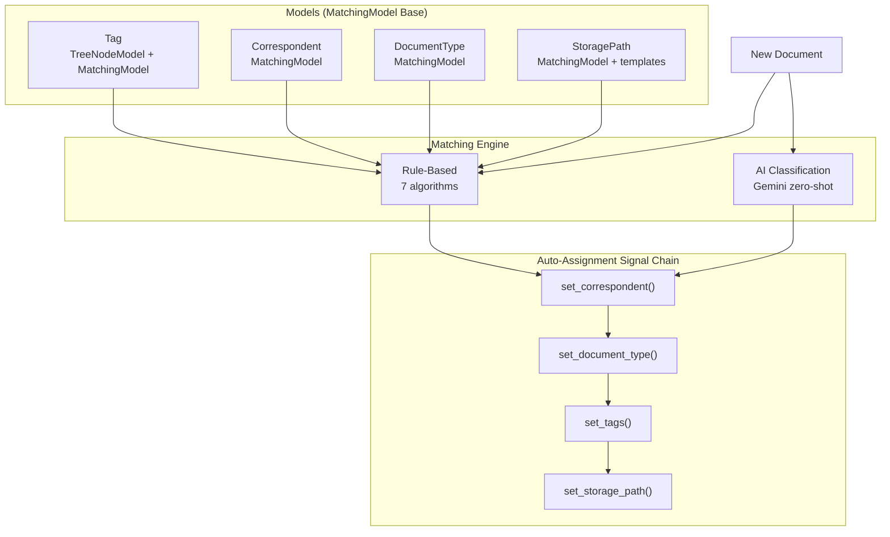

# 03 — Classification, Tagging & Matching Engine

> **Goal**: Implement the `MatchingModel` pattern from Paperless-ngx and enhance it with Gemini AI classification.

---

## Architecture Overview



---

## MatchingModel Base Class

```python
# backend/app/models/matching.py

import enum
from sqlalchemy import String, Integer, Boolean, Enum as SQLEnum, ForeignKey
from sqlalchemy.orm import Mapped, mapped_column
from .base import Base
from .mixins import TimestampMixin, UserOwnedMixin


class MatchingAlgorithm(int, enum.Enum):
    NONE = 0       # Never auto-match
    ANY = 1        # Content contains ANY keyword
    ALL = 2        # Content contains ALL keywords
    LITERAL = 3    # Exact substring match
    REGEX = 4      # Regular expression match
    FUZZY = 5      # Fuzzy match (ratio > 85%)
    AUTO = 6       # AI/ML classification


class MatchingModel(Base, TimestampMixin, UserOwnedMixin):
    """
    Abstract base for models with auto-assignment matching.

    Paperless reference: documents/models.py MatchingModel
    """
    __abstract__ = True

    name: Mapped[str] = mapped_column(String(128), nullable=False)
    match: Mapped[str] = mapped_column(
        String(256), nullable=True, default="",
        doc="Matching keywords/pattern (comma-separated for ANY/ALL)"
    )
    matching_algorithm: Mapped[int] = mapped_column(
        Integer, default=MatchingAlgorithm.NONE,
        doc="Matching algorithm (0=none, 1=any, 2=all, 3=literal, 4=regex, 5=fuzzy, 6=auto)"
    )
    is_insensitive: Mapped[bool] = mapped_column(
        Boolean, default=True,
        doc="Case insensitive matching"
    )
```

---

## Concrete Models

### Tag (Enhanced)

```python
# backend/app/models/tag.py — REPLACE current 62-line model

class Tag(MatchingModel):
    __tablename__ = "tags"

    id: Mapped[int] = mapped_column(primary_key=True, autoincrement=True)
    color: Mapped[str] = mapped_column(String(7), default="#a6cee3")
    is_inbox_tag: Mapped[bool] = mapped_column(Boolean, default=False)

    # Hierarchy (TreeNode)
    parent_id: Mapped[Optional[int]] = mapped_column(
        ForeignKey("tags.id", ondelete="SET NULL"), nullable=True
    )
    # Relationships
    documents = relationship("Document", secondary="document_tags", back_populates="tags")
    parent = relationship("Tag", remote_side=[id])
```

### Correspondent (New)

```python
# backend/app/models/correspondent.py

class Correspondent(MatchingModel):
    __tablename__ = "correspondents"

    id: Mapped[int] = mapped_column(primary_key=True, autoincrement=True)
    # Relationships
    documents = relationship("Document", back_populates="correspondent")
```

### DocumentType (New)

```python
# backend/app/models/document_type.py

class DocumentType(MatchingModel):
    __tablename__ = "document_types"

    id: Mapped[int] = mapped_column(primary_key=True, autoincrement=True)
    # Relationships
    documents = relationship("Document", back_populates="document_type")
```

### StoragePath (New)

```python
# backend/app/models/storage_path.py

class StoragePath(MatchingModel):
    __tablename__ = "storage_paths"

    id: Mapped[int] = mapped_column(primary_key=True, autoincrement=True)
    path_template: Mapped[str] = mapped_column(
        String(512), nullable=False,
        doc="Jinja2 template: {correspondent}/{created_year}/{title}"
    )
    # Relationships
    documents = relationship("Document", back_populates="storage_path")
```

---

## Document ↔ Tag Join Table

```python
# backend/app/models/document_tags.py

document_tags = Table(
    "document_tags",
    Base.metadata,
    Column("document_id", Integer, ForeignKey("documents.id", ondelete="CASCADE")),
    Column("tag_id", Integer, ForeignKey("tags.id", ondelete="CASCADE")),
    UniqueConstraint("document_id", "tag_id"),
)
```

---

## Document Model Changes

```python
# backend/app/models/document.py — ADD these fields

# Classification
correspondent_id: Mapped[Optional[int]] = mapped_column(
    ForeignKey("correspondents.id", ondelete="SET NULL"), nullable=True, index=True
)
document_type_id: Mapped[Optional[int]] = mapped_column(
    ForeignKey("document_types.id", ondelete="SET NULL"), nullable=True, index=True
)
storage_path_id: Mapped[Optional[int]] = mapped_column(
    ForeignKey("storage_paths.id", ondelete="SET NULL"), nullable=True, index=True
)
archive_serial_number: Mapped[Optional[int]] = mapped_column(
    Integer, nullable=True, unique=True, index=True
)
mime_type: Mapped[Optional[str]] = mapped_column(String(256), nullable=True)
archive_path: Mapped[Optional[str]] = mapped_column(String(500), nullable=True)
archive_checksum: Mapped[Optional[str]] = mapped_column(String(64), nullable=True)
created_date: Mapped[Optional[datetime]] = mapped_column(DateTime, nullable=True)

# Relationships
correspondent = relationship("Correspondent", back_populates="documents")
document_type = relationship("DocumentType", back_populates="documents")
storage_path = relationship("StoragePath", back_populates="documents")
tags = relationship("Tag", secondary="document_tags", back_populates="documents")
```

---

## Matching Engine

```python
# backend/app/services/classification/matching.py

import re
from difflib import SequenceMatcher
from typing import Optional
from app.models.matching import MatchingAlgorithm


def matches(model_instance, document_content: str) -> bool:
    """
    Check if a MatchingModel instance matches the document content.

    Paperless reference: documents/matching.py
    """
    algo = model_instance.matching_algorithm
    match_str = model_instance.match or ""
    content = document_content

    if model_instance.is_insensitive:
        match_str = match_str.lower()
        content = content.lower()

    if algo == MatchingAlgorithm.NONE:
        return False

    elif algo == MatchingAlgorithm.ANY:
        keywords = [k.strip() for k in match_str.split(",")]
        return any(kw in content for kw in keywords if kw)

    elif algo == MatchingAlgorithm.ALL:
        keywords = [k.strip() for k in match_str.split(",")]
        return all(kw in content for kw in keywords if kw)

    elif algo == MatchingAlgorithm.LITERAL:
        return match_str in content

    elif algo == MatchingAlgorithm.REGEX:
        flags = re.IGNORECASE if model_instance.is_insensitive else 0
        return bool(re.search(model_instance.match, document_content, flags))

    elif algo == MatchingAlgorithm.FUZZY:
        words = content.split()
        keywords = match_str.split(",")
        for keyword in keywords:
            keyword = keyword.strip()
            if not keyword:
                continue
            for i in range(len(words)):
                window = " ".join(words[i:i + len(keyword.split())])
                if SequenceMatcher(None, keyword, window).ratio() > 0.85:
                    return True
        return False

    elif algo == MatchingAlgorithm.AUTO:
        return False  # Handled by AI classifier separately

    return False
```

---

## AI Classification (Synapse Advantage)

### Zero-Shot Gemini Classifier

```python
# backend/app/services/classification/ai_classifier.py

from typing import Optional, List
import logging

logger = logging.getLogger(__name__)


class AIDocumentClassifier:
    """
    Zero-shot document classification using Gemini.

    Unlike Paperless's scikit-learn MLPClassifier (requires training data),
    this works immediately on any domain without training.

    Uses the document's first ~5000 chars to classify against
    the user's defined correspondents, document types, and tags.
    """

    async def classify(
        self,
        document_text: str,
        available_correspondents: list[dict],
        available_document_types: list[dict],
        available_tags: list[dict],
    ) -> dict:
        """
        Classify a document against available categories.

        Returns:
            {
                "correspondent_id": int | None,
                "document_type_id": int | None,
                "tag_ids": [int, ...],
                "confidence": float,
            }
        """
        # Crop text for classification (Paperless uses 80% head + 20% tail)
        suggestion_text = self._get_suggestion_text(document_text)

        prompt = self._build_classification_prompt(
            suggestion_text,
            available_correspondents,
            available_document_types,
            available_tags,
        )

        # Call Gemini
        from app.core.ai.llm import get_llm_client
        client = get_llm_client()
        result = await client.generate(prompt, response_format="json")

        return self._parse_result(result)

    def _get_suggestion_text(self, text: str, max_length: int = 5000) -> str:
        """Use 80% from start + 20% from end (Paperless pattern)."""
        if len(text) <= max_length:
            return text
        head = int(max_length * 0.8)
        tail = max_length - head
        return text[:head] + "\n...\n" + text[-tail:]

    def _build_classification_prompt(self, text, correspondents, types, tags):
        return f"""Classify this document. Return JSON only.

Available Correspondents: {[c['name'] for c in correspondents]}
Available Document Types: {[t['name'] for t in types]}
Available Tags: {[t['name'] for t in tags]}

Document content:
{text}

Return: {{"correspondent": "name or null", "document_type": "name or null", "tags": ["tag1", ...]}}"""
```

---

## Post-Consumption Signal Chain

```python
# backend/app/services/classification/auto_assign.py

async def auto_classify_document(document_id: int, db):
    """
    Run after document consumption.
    Combines rule-based matching + AI classification.
    """
    document = await get_document(document_id, db)
    content = document.content_text or ""
    user_id = document.user_id

    # 1. Rule-based matching
    from app.services.classification.matching import matches

    # Match correspondents (first match wins)
    correspondents = await get_user_correspondents(user_id, db)
    for corr in correspondents:
        if corr.matching_algorithm != MatchingAlgorithm.AUTO and matches(corr, content):
            document.correspondent_id = corr.id
            break

    # Match document type (first match wins)
    doc_types = await get_user_document_types(user_id, db)
    for dt in doc_types:
        if dt.matching_algorithm != MatchingAlgorithm.AUTO and matches(dt, content):
            document.document_type_id = dt.id
            break

    # Match tags (all matches applied)
    tags = await get_user_tags(user_id, db)
    matched_tags = [t for t in tags
                    if t.matching_algorithm != MatchingAlgorithm.AUTO and matches(t, content)]
    document.tags.extend(matched_tags)

    # 2. AI classification for AUTO items
    auto_items_exist = any(
        m.matching_algorithm == MatchingAlgorithm.AUTO
        for m in correspondents + doc_types + tags
    )

    if auto_items_exist:
        classifier = AIDocumentClassifier()
        prediction = await classifier.classify(
            content,
            [{"id": c.id, "name": c.name} for c in correspondents if c.matching_algorithm == MatchingAlgorithm.AUTO],
            [{"id": d.id, "name": d.name} for d in doc_types if d.matching_algorithm == MatchingAlgorithm.AUTO],
            [{"id": t.id, "name": t.name} for t in tags if t.matching_algorithm == MatchingAlgorithm.AUTO],
        )

        # Apply AI results (only if rule-based didn't already assign)
        if not document.correspondent_id and prediction.get("correspondent_id"):
            document.correspondent_id = prediction["correspondent_id"]
        if not document.document_type_id and prediction.get("document_type_id"):
            document.document_type_id = prediction["document_type_id"]
        for tag_id in prediction.get("tag_ids", []):
            if tag_id not in [t.id for t in document.tags]:
                tag = await get_tag(tag_id, db)
                document.tags.append(tag)

    # 3. Inbox tags
    inbox_tags = await get_inbox_tags(user_id, db)
    document.tags.extend(inbox_tags)

    await db.commit()
```

---

## Engineering Tasks

1. **Create `MatchingModel`** abstract base in `models/matching.py`
2. **Create `Correspondent` model** with MatchingModel inheritance
3. **Create `DocumentType` model** with MatchingModel inheritance
4. **Create `StoragePath` model** with MatchingModel + path templates
5. **Evolve `Tag` model** — add `MatchingModel` inheritance, `parent_id`, `is_inbox_tag`
6. **Create `document_tags` join table** (M2M)
7. **Add classification FKs** to `Document` model (correspondent_id, document_type_id, storage_path_id)
8. **Implement matching engine** — 7 algorithms in `services/classification/matching.py`
9. **Implement AI classifier** — Gemini zero-shot in `services/classification/ai_classifier.py`
10. **Implement auto-assignment chain** — `auto_classify_document()` combining rules + AI
11. **Wire signal** from consumer pipeline to auto-classify
12. **Create CRUD API endpoints** for Correspondent, DocumentType, StoragePath
13. **Create Alembic migration** for all new tables + columns
14. **Deprecate** `TopicTagger` (replaced by classification engine)
