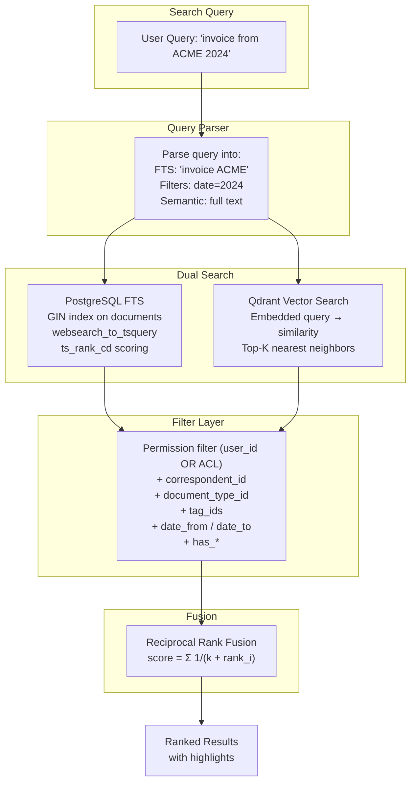

# 04 — Search Architecture

> **Goal**: Replace chunk-only PostgreSQL FTS with a document-level search system that matches Paperless-ngx's capabilities, then surpass it with Qdrant vector search.

---

## Source of Truth: Paperless Implementation

### Key Paperless Files

| File | Lines | What We're Sourcing |
|---|---|---|
| [index.py](file:///home/de3f4ault/Desktop/Projects/synapse/tests/paperless-ngx/src/documents/index.py) | 618 | Full Whoosh search schema, indexing pipeline, query strategies, permission filtering |
| [models.py](file:///home/de3f4ault/Desktop/Projects/synapse/tests/paperless-ngx/src/documents/models.py) L656-779 | `SavedView` + `SavedViewFilterRule` models |
| [views.py](file:///home/de3f4ault/Desktop/Projects/synapse/tests/paperless-ngx/src/documents/views.py) | Search API viewsets and filter integration |
| [tasks.py](file:///home/de3f4ault/Desktop/Projects/synapse/tests/paperless-ngx/src/documents/tasks.py) L63-78 | `index_optimize()` + `index_reindex()` tasks |

### Paperless Search Schema — 35 Fields

From [index.py:61-96](file:///home/de3f4ault/Desktop/Projects/synapse/tests/paperless-ngx/src/documents/index.py#L61-L96):

```python
def get_schema() -> Schema:
    return Schema(
        id=NUMERIC(stored=True, unique=True),
        title=TEXT(sortable=True),
        content=TEXT(),
        asn=NUMERIC(sortable=True, signed=False),
        correspondent=TEXT(sortable=True),
        correspondent_id=NUMERIC(),
        has_correspondent=BOOLEAN(),
        tag=KEYWORD(commas=True, scorable=True, lowercase=True),
        tag_id=KEYWORD(commas=True, scorable=True),
        has_tag=BOOLEAN(),
        type=TEXT(sortable=True),
        type_id=NUMERIC(),
        has_type=BOOLEAN(),
        created=DATETIME(sortable=True),
        modified=DATETIME(sortable=True),
        added=DATETIME(sortable=True),
        path=TEXT(sortable=True),
        path_id=NUMERIC(),
        has_path=BOOLEAN(),
        notes=TEXT(),
        num_notes=NUMERIC(sortable=True, signed=False),
        custom_fields=TEXT(),
        custom_field_count=NUMERIC(sortable=True, signed=False),
        has_custom_fields=BOOLEAN(),
        custom_fields_id=KEYWORD(commas=True),
        owner=TEXT(),
        owner_id=NUMERIC(),
        has_owner=BOOLEAN(),
        viewer_id=KEYWORD(commas=True),
        checksum=TEXT(),
        page_count=NUMERIC(sortable=True),
        original_filename=TEXT(sortable=True),
        is_shared=BOOLEAN(),
    )
```

### Paperless Document Indexing

From [index.py:137-198](file:///home/de3f4ault/Desktop/Projects/synapse/tests/paperless-ngx/src/documents/index.py#L137-L198) — the `update_document()` function populates all 35 fields:

```python
def update_document(writer: AsyncWriter, doc: Document) -> None:
    tags = ",".join([t.name for t in doc.tags.all()])
    tags_ids = ",".join([str(t.id) for t in doc.tags.all()])
    notes = ",".join([str(c.note) for c in Note.objects.filter(document=doc)])
    custom_fields = ",".join(
        [str(c) for c in CustomFieldInstance.objects.filter(document=doc)]
    )
    users_with_perms = get_users_with_perms(
        doc, only_with_perms_in=["view_document"],
    )
    viewer_ids = ",".join([str(u.id) for u in users_with_perms])
    writer.update_document(
        id=doc.pk,
        title=doc.title,
        content=doc.content,
        correspondent=doc.correspondent.name if doc.correspondent else None,
        tag=tags if tags else None,
        type=doc.document_type.name if doc.document_type else None,
        created=datetime.combine(doc.created, time.min),
        notes=notes,
        custom_fields=custom_fields,
        owner=doc.owner.username if doc.owner else None,
        viewer_id=viewer_ids if viewer_ids else None,
        # ... 20+ more fields
    )
```

### Paperless Query Strategies

From [index.py:422-478](file:///home/de3f4ault/Desktop/Projects/synapse/tests/paperless-ngx/src/documents/index.py#L422-L478):

**`DelayedFullTextQuery`** — Multi-field search across 7 fields simultaneously:

```python
class DelayedFullTextQuery(DelayedQuery):
    def _get_query(self):
        q_str = self.query_params["query"]
        qp = MultifieldParser(
            ["content", "title", "correspondent", "tag", "type", "notes", "custom_fields"],
            self.searcher.ixreader.schema,
        )
        qp.add_plugin(DateParserPlugin(basedate=django_timezone.now(), dateparser=LocalDateParser()))
        q = qp.parse(q_str)
        # Spell correction
        corrected = self.searcher.correct_query(q, q_str)
        if corrected.string != q_str:
            suggested_correction = corrected.string
        return q, None, suggested_correction
```

**`DelayedMoreLikeThisQuery`** — Document similarity using key term extraction:

```python
class DelayedMoreLikeThisQuery(DelayedQuery):
    def _get_query(self):
        more_like_doc_id = int(self.query_params["more_like_id"])
        content = Document.objects.get(id=more_like_doc_id).content
        docnum = self.searcher.document_number(id=more_like_doc_id)
        kts = self.searcher.key_terms_from_text(
            "content", content, numterms=20,
            model=classify.Bo1Model, normalize=False,
        )
        q = query.Or([query.Term("content", word, boost=weight) for word, weight in kts])
        return q, {docnum}, None  # mask excludes the source document
```

### Permission-Aware Search

From [index.py:220-236](file:///home/de3f4ault/Desktop/Projects/synapse/tests/paperless-ngx/src/documents/index.py#L220-L236) — `MappedDocIdSet` intersects Whoosh results with django-guardian ACLs:

```python
class MappedDocIdSet(DocIdSet):
    def __init__(self, filter_queryset, ixreader):
        document_ids = filter_queryset.order_by("id").values_list("id", flat=True)
        max_id = document_ids.last() or 0
        self.document_ids = BitSet(document_ids, size=max_id)
        self.ixreader = ixreader

    def __contains__(self, docnum):
        document_id = self.ixreader.stored_fields(docnum)["id"]
        return document_id in self.document_ids
```

And from [index.py:521-531](file:///home/de3f4ault/Desktop/Projects/synapse/tests/paperless-ngx/src/documents/index.py#L521-L531):

```python
def get_permissions_criterias(user=None):
    user_criterias = [query.Term("has_owner", text=False)]  # unowned = public
    if user is not None:
        if user.is_superuser:
            user_criterias = []  # superusers see everything
        else:
            user_criterias.append(query.Term("owner_id", user.id))
            user_criterias.append(query.Term("viewer_id", str(user.id)))  # ACL
    return user_criterias
```

---

## Existing Synapse Search System

> [!IMPORTANT]
> Synapse already has a **mature 12-file search system**. The DMS search additions **extend** this system — they do NOT replace it.

| File | Size | What It Does | DMS Change |
|---|---|---|---|
| [unified_service.py](file:///home/de3f4ault/Desktop/Projects/synapse/backend/app/services/search/unified_service.py) | 605 lines | `UnifiedSearchService` — orchestrates Hybrid, RAG, and Graph engines | **Extend**: Add DMS adapter for document-level search with metadata filters |
| [hybrid_v2.py](file:///home/de3f4ault/Desktop/Projects/synapse/backend/app/services/search/hybrid_v2.py) | 477 lines | `HybridSearchServiceV2` — SQL-level BM25 + Vector with RRF | **Extend**: Add document entity type alongside notes/flashcards/chat |
| [fulltext.py](file:///home/de3f4ault/Desktop/Projects/synapse/backend/app/services/search/fulltext.py) | 252 lines | PostgreSQL FTS with `ts_rank` | **Extend**: Add `search_vector` GIN query for documents table |
| [adapters.py](file:///home/de3f4ault/Desktop/Projects/synapse/backend/app/services/search/adapters.py) | 309 lines | Result adapters for notes/flashcards/chat | **Add**: `adapt_dms_document_results()` adapter |
| [unified_retrieval.py](file:///home/de3f4ault/Desktop/Projects/synapse/backend/app/services/search/unified_retrieval.py) | 308 lines | Multi-source retrieval | No changes |
| [ranking.py](file:///home/de3f4ault/Desktop/Projects/synapse/backend/app/services/search/ranking.py) | 188 lines | Result ranking + weights | No changes |
| [analytics.py](file:///home/de3f4ault/Desktop/Projects/synapse/backend/app/services/search/analytics.py) | 188 lines | Search analytics | No changes |
| [contract.py](file:///home/de3f4ault/Desktop/Projects/synapse/backend/app/services/search/contract.py) | 109 lines | Search interface contracts | **Extend**: Add `SearchIntent.DMS_FILTER` |
| [result_types.py](file:///home/de3f4ault/Desktop/Projects/synapse/backend/app/services/search/result_types.py) | 38 lines | Result type definitions | **Add**: `DMS_DOCUMENT` result type |
| [zero_result_handler.py](file:///home/de3f4ault/Desktop/Projects/synapse/backend/app/services/search/zero_result_handler.py) | 122 lines | Zero-result fallback | No changes |
| [chat_embedding.py](file:///home/de3f4ault/Desktop/Projects/synapse/backend/app/services/search/chat_embedding.py) | 89 lines | Chat embedding search | No changes |
| [search.py API](file:///home/de3f4ault/Desktop/Projects/synapse/backend/app/api/rest/search.py) | 420 lines | Search API endpoints | **Extend**: Add DMS filter params, saved view execution endpoint |

**Integration strategy**: The new `SearchService` (DMS-focused, Paperless-inspired) acts as a **domain-specific search engine** that plugs into the existing `UnifiedSearchService` as a new engine alongside Hybrid, RAG, and Graph. It does NOT replace the existing search infrastructure.

---

## Synapse Files Being Modified

| File | Current State | Change |
|---|---|---|
| [repository.py](file:///home/de3f4ault/Desktop/Projects/synapse/backend/app/modules/documents/repository.py) (237 lines) | `search_chunks()` — raw SQL with `ts_rank` + `to_tsvector` on `document_chunks.content` only | **Major rewrite**: Add document-level `search_documents()` with GIN index on `documents.search_vector` |
| [documents.py API](file:///home/de3f4ault/Desktop/Projects/synapse/backend/app/api/rest/documents.py) (421 lines) | `list_documents()` — basic filters (folder_id, status, sort_order) | **Extend**: Add full-text search query param, tag/type/correspondent filters, saved view execution |
| [document.py model](file:///home/de3f4ault/Desktop/Projects/synapse/backend/app/models/document.py) | No `search_vector` column | **Add**: Generated `tsvector` column + GIN index |
| **New file**: `services/search/dms_search.py` | Does not exist | **Create**: DMS `SearchService` — document-level FTS + metadata filters (integrates with `UnifiedSearchService`) |
| **New file**: `services/search/saved_view_executor.py` | Does not exist | **Create**: Convert `SavedView` filter rules to search params |
| **New file**: `services/search/tasks.py` | Does not exist | **Create**: Index maintenance periodic task |
| **New file**: `models/saved_view.py` | Does not exist | **Create**: `SavedView` + `SavedViewFilterRule` models |

---

## Synapse's Design Decision: PostgreSQL GIN vs Whoosh

Paperless uses **Whoosh** (a pure-Python search library) for its full-text index. For Synapse, we will use **PostgreSQL's built-in GIN indexes with tsvector** because:

1. Synapse already uses PostgreSQL — no additional service to deploy
2. PostgreSQL `websearch_to_tsquery` supports natural language queries out of the box
3. GIN + tsvector performance is comparable to Whoosh for document-scale datasets
4. Eliminates index synchronization issues (index IS the database)
5. Generated columns keep the index automatically up-to-date

**Trade-off**: PostgreSQL FTS doesn't natively support "More Like This" or spell correction — but Synapse already has **Qdrant vector search** which provides superior similarity search. We'll combine both.

---

## Target Architecture



---

## Database Changes

### Search Vector Column

```sql
-- Alembic migration: add_search_vector_to_documents

-- Generated tsvector column that auto-updates
ALTER TABLE documents ADD COLUMN search_vector tsvector
    GENERATED ALWAYS AS (
        setweight(to_tsvector('english', coalesce(filename, '')), 'A') ||
        setweight(to_tsvector('english', coalesce(notes, '')), 'B') ||
        setweight(to_tsvector('english', coalesce(content_text, '')), 'C')
    ) STORED;

-- GIN index for fast lookup
CREATE INDEX idx_documents_search_vector ON documents USING GIN (search_vector);

-- Additional indexes for filter performance
CREATE INDEX idx_documents_user_created ON documents (user_id, created_date);
CREATE INDEX idx_documents_user_correspondent ON documents (user_id, correspondent_id) WHERE deleted_at IS NULL;
CREATE INDEX idx_documents_user_type ON documents (user_id, document_type_id) WHERE deleted_at IS NULL;
CREATE INDEX idx_documents_created_date ON documents (created_date);
```

Weight system explanation:

- **A** (highest): filename — searching by filename should strongly match
- **B**: notes — user-written annotations are intentional metadata
- **C** (lowest): content — full document text, broad matches

---

## SearchService Implementation

```python
# backend/app/services/search/service.py

import logging
from typing import Optional
from sqlalchemy import text, select, and_, or_, func
from sqlalchemy.ext.asyncio import AsyncSession

logger = logging.getLogger(__name__)


class SearchService:
    """
    Hybrid search service combining:
    1. PostgreSQL GIN full-text search (keyword matching)
    2. Qdrant vector similarity search (semantic matching)
    3. Metadata filtering (tags, types, dates, correspondents)

    Sourced from Paperless: index.py (618 lines)
    - Schema: 35 fields (we implement 20+ equivalent via PostgreSQL)
    - Query strategies: Full-text + More-Like-This + filtered
    - Permission filtering: MappedDocIdSet pattern
    """

    def __init__(self, session: AsyncSession):
        self.session = session

    async def search(
        self,
        user_id: int,
        query: str = "",
        # Metadata filters (Paperless equivalent: SavedViewFilterRule types)
        correspondent_id: Optional[int] = None,
        document_type_id: Optional[int] = None,
        storage_path_id: Optional[int] = None,
        tag_ids: Optional[list[int]] = None,
        tag_ids_exclude: Optional[list[int]] = None,
        has_any_tag: Optional[bool] = None,
        has_correspondent: Optional[bool] = None,
        has_document_type: Optional[bool] = None,
        # Date filters
        created_date_from: Optional[str] = None,
        created_date_to: Optional[str] = None,
        added_date_from: Optional[str] = None,
        added_date_to: Optional[str] = None,
        # Sorting (Paperless: DelayedQuery._get_query_sortedby)
        sort_by: str = "rank",  # rank, created_date, filename, added
        sort_reverse: bool = True,
        # Pagination
        page: int = 1,
        page_size: int = 25,
    ) -> dict:
        """
        Full-text search across documents with metadata filtering.

        Equivalent to Paperless's DelayedFullTextQuery but using
        PostgreSQL's websearch_to_tsquery instead of Whoosh's MultifieldParser.
        """
        conditions = ["d.user_id = :user_id", "d.deleted_at IS NULL"]
        params: dict = {"user_id": user_id}

        # Full-text search using GIN index
        # Paperless equivalent: MultifieldParser(["content", "title", ...])
        if query:
            conditions.append(
                "d.search_vector @@ websearch_to_tsquery('english', :query)"
            )
            params["query"] = query

        # -- Metadata filters --
        # Paperless equivalent: SavedViewFilterRule types 3, 4, 6, 7, 8, 9, etc.

        if correspondent_id is not None:
            conditions.append("d.correspondent_id = :correspondent_id")
            params["correspondent_id"] = correspondent_id

        if document_type_id is not None:
            conditions.append("d.document_type_id = :document_type_id")
            params["document_type_id"] = document_type_id

        if storage_path_id is not None:
            conditions.append("d.storage_path_id = :storage_path_id")
            params["storage_path_id"] = storage_path_id

        if tag_ids:
            # HAS any of these tags
            conditions.append(
                "EXISTS (SELECT 1 FROM document_tags dt "
                "WHERE dt.document_id = d.id AND dt.tag_id = ANY(:tag_ids))"
            )
            params["tag_ids"] = tag_ids

        if tag_ids_exclude:
            # DOES NOT HAVE any of these tags
            conditions.append(
                "NOT EXISTS (SELECT 1 FROM document_tags dt "
                "WHERE dt.document_id = d.id AND dt.tag_id = ANY(:tag_ids_exclude))"
            )
            params["tag_ids_exclude"] = tag_ids_exclude

        if has_any_tag is not None:
            if has_any_tag:
                conditions.append(
                    "EXISTS (SELECT 1 FROM document_tags dt WHERE dt.document_id = d.id)"
                )
            else:
                conditions.append(
                    "NOT EXISTS (SELECT 1 FROM document_tags dt WHERE dt.document_id = d.id)"
                )

        if has_correspondent is not None:
            if has_correspondent:
                conditions.append("d.correspondent_id IS NOT NULL")
            else:
                conditions.append("d.correspondent_id IS NULL")

        if has_document_type is not None:
            if has_document_type:
                conditions.append("d.document_type_id IS NOT NULL")
            else:
                conditions.append("d.document_type_id IS NULL")

        # Date range filters
        if created_date_from:
            conditions.append("d.created_date >= :created_date_from")
            params["created_date_from"] = created_date_from
        if created_date_to:
            conditions.append("d.created_date <= :created_date_to")
            params["created_date_to"] = created_date_to
        if added_date_from:
            conditions.append("d.created_at >= :added_date_from")
            params["added_date_from"] = added_date_from
        if added_date_to:
            conditions.append("d.created_at <= :added_date_to")
            params["added_date_to"] = added_date_to

        # Build WHERE clause
        where = " AND ".join(conditions)

        # Ranking expression
        # Paperless equivalent: TF-IDF scoring via Whoosh
        # We use ts_rank_cd (cover density ranking — considers term proximity)
        rank_expr = (
            "ts_rank_cd(d.search_vector, websearch_to_tsquery('english', :query), 32)"
            if query else "0"
        )

        # Sorting
        # Paperless equivalent: sort_fields_map in DelayedQuery._get_query_sortedby
        sort_map = {
            "rank": f"{rank_expr} DESC",
            "created_date": f"d.created_date {'DESC' if sort_reverse else 'ASC'}",
            "created_at": f"d.created_at {'DESC' if sort_reverse else 'ASC'}",
            "filename": f"d.filename {'DESC' if sort_reverse else 'ASC'}",
            "page_count": f"d.page_count {'DESC' if sort_reverse else 'ASC'}",
        }
        order = sort_map.get(sort_by, f"{rank_expr} DESC")

        # Highlight snippets
        # Paperless equivalent: ContextFragmenter(surround=50) + HtmlFormatter
        highlight_expr = ""
        if query:
            highlight_expr = (
                ", ts_headline('english', d.content_text, "
                "websearch_to_tsquery('english', :query), "
                "'StartSel=<mark>, StopSel=</mark>, MaxWords=50, MinWords=20') as highlight"
            )

        # Count total results
        count_sql = text(f"SELECT COUNT(*) FROM documents d WHERE {where}")
        count_result = await self.session.execute(count_sql, params)
        total = count_result.scalar()

        # Get results page
        sql = text(f"""
            SELECT d.id, d.filename, d.file_type, d.file_size,
                   d.page_count, d.word_count, d.created_date, d.created_at,
                   d.correspondent_id, d.document_type_id, d.storage_path_id,
                   d.archive_serial_number, d.processing_status,
                   d.mime_type, d.content_hash,
                   {rank_expr} as rank
                   {highlight_expr}
            FROM documents d
            WHERE {where}
            ORDER BY {order}
            LIMIT :limit OFFSET :offset
        """)
        params["limit"] = page_size
        params["offset"] = (page - 1) * page_size

        result = await self.session.execute(sql, params)
        rows = [dict(row._mapping) for row in result.fetchall()]

        # Attach tags for each result
        if rows:
            doc_ids = [r["id"] for r in rows]
            tags_sql = text("""
                SELECT dt.document_id, t.id, t.name, t.color
                FROM document_tags dt
                JOIN tags t ON dt.tag_id = t.id
                WHERE dt.document_id = ANY(:doc_ids)
            """)
            tags_result = await self.session.execute(tags_sql, {"doc_ids": doc_ids})
            tags_by_doc = {}
            for row in tags_result.fetchall():
                doc_id = row[0]
                if doc_id not in tags_by_doc:
                    tags_by_doc[doc_id] = []
                tags_by_doc[doc_id].append({
                    "id": row[1], "name": row[2], "color": row[3]
                })

            for r in rows:
                r["tags"] = tags_by_doc.get(r["id"], [])

        return {
            "total": total,
            "page": page,
            "page_size": page_size,
            "results": rows,
        }

    async def semantic_search(
        self, user_id: int, query: str, limit: int = 10
    ) -> list[dict]:
        """
        Vector similarity search via Qdrant.
        Synapse-native — Paperless has NO equivalent.

        Uses pre-embedded document chunks for conceptual
        matching ("find invoices similar to this one").
        """
        from app.services.vector.qdrant_service import search_similar
        return await search_similar(user_id, query, limit)

    async def hybrid_search(
        self, user_id: int, query: str, **kwargs
    ) -> dict:
        """
        Combine FTS + vector results with Reciprocal Rank Fusion.

        RRF score = Σ 1/(k + rank_i) for each ranking system
        where k=60 (standard constant).

        This gives us the best of both worlds:
        - FTS catches exact keyword matches
        - Vector catches conceptual/semantic matches
        """
        fts_results = await self.search(user_id, query, **kwargs)
        vec_results = await self.semantic_search(user_id, query)

        return self._reciprocal_rank_fusion(
            fts_results["results"], vec_results, k=60
        )

    def _reciprocal_rank_fusion(
        self, fts_results: list, vec_results: list, k: int = 60
    ) -> list[dict]:
        """
        Merge two ranked result lists using RRF.
        """
        scores = {}

        for rank, result in enumerate(fts_results):
            doc_id = result["id"]
            scores[doc_id] = scores.get(doc_id, 0) + 1.0 / (k + rank)
            scores[doc_id] = (scores[doc_id], result)  # store data

        for rank, result in enumerate(vec_results):
            doc_id = result.get("document_id") or result.get("id")
            if doc_id in scores:
                existing_score, data = scores[doc_id]
                scores[doc_id] = (existing_score + 1.0 / (k + rank), data)
            else:
                scores[doc_id] = (1.0 / (k + rank), result)

        # Sort by combined score descending
        sorted_results = sorted(scores.values(), key=lambda x: x[0], reverse=True)
        return [{"score": score, **data} for score, data in sorted_results]
```

---

## Saved Views (Paperless Equivalent)

### Source: Paperless SavedView Model

From Paperless `models.py` lines ~656-779 — SavedView stores a named filter preset:

```python
# Paperless original (simplified)
class SavedView(OwnedObjectModel):
    name = CharField(max_length=128)
    show_on_dashboard = BooleanField(default=False)
    show_in_sidebar = BooleanField(default=False)
    sort_field = CharField(max_length=128, default="created")
    sort_reverse = BooleanField(default=True)
    filter_rules = ManyToManyField(SavedViewFilterRule)
    page_size = PositiveIntegerField(default=25)

class SavedViewFilterRule(models.Model):
    # 48 rule types (none=0 through owner_does_not_have=35)
    rule_type = PositiveIntegerField(choices=FILTER_RULE_TYPES)
    value = CharField(max_length=256, blank=True, null=True)
```

### Synapse Implementation

```python
# backend/app/models/saved_view.py

import enum
from sqlalchemy import String, Integer, Boolean, ForeignKey
from sqlalchemy.orm import Mapped, mapped_column, relationship
from .base import Base
from .mixins import TimestampMixin, UserOwnedMixin


class FilterRuleType(int, enum.Enum):
    """
    Filter rule types matching Paperless's 48 types.
    We implement the most useful subset first.
    """
    # Content
    TITLE_CONTAINS = 0
    CONTENT_CONTAINS = 1

    # Classification
    CORRESPONDENT_IS = 3
    DOCUMENT_TYPE_IS = 4
    IS_IN_FOLDER = 5

    # Tags
    HAS_TAG = 6
    DOES_NOT_HAVE_TAG = 7
    HAS_ANY_TAG = 17

    # Dates
    CREATED_BEFORE = 8
    CREATED_AFTER = 9
    ADDED_BEFORE = 10
    ADDED_AFTER = 11

    # Metadata
    FILENAME_IS = 14
    FULLTEXT_QUERY = 20
    MORE_LIKE_THIS = 21

    # Classification existence
    HAS_CORRESPONDENT = 22
    HAS_DOCUMENT_TYPE = 23
    STORAGE_PATH_IS = 24

    # Ownership
    OWNER_IS = 30
    OWNER_ISNOT = 31
    HAS_OWNER = 32
    DOES_NOT_HAVE_OWNER = 33


class SavedView(Base, TimestampMixin, UserOwnedMixin):
    __tablename__ = "saved_views"

    id: Mapped[int] = mapped_column(primary_key=True, autoincrement=True)
    name: Mapped[str] = mapped_column(String(128), nullable=False)
    sort_field: Mapped[str] = mapped_column(String(50), default="created_at")
    sort_reverse: Mapped[bool] = mapped_column(Boolean, default=True)
    show_on_dashboard: Mapped[bool] = mapped_column(Boolean, default=False)
    show_in_sidebar: Mapped[bool] = mapped_column(Boolean, default=False)
    page_size: Mapped[int] = mapped_column(Integer, default=25)

    filter_rules: Mapped[list["SavedViewFilterRule"]] = relationship(
        back_populates="saved_view", cascade="all, delete-orphan"
    )


class SavedViewFilterRule(Base):
    __tablename__ = "saved_view_filter_rules"

    id: Mapped[int] = mapped_column(primary_key=True, autoincrement=True)
    saved_view_id: Mapped[int] = mapped_column(
        ForeignKey("saved_views.id", ondelete="CASCADE"), index=True
    )
    rule_type: Mapped[int] = mapped_column(Integer, nullable=False)
    value: Mapped[str] = mapped_column(String(256), nullable=True)

    saved_view: Mapped["SavedView"] = relationship(back_populates="filter_rules")
```

### Saved View Execution

```python
# backend/app/services/search/saved_view_executor.py

class SavedViewExecutor:
    """
    Convert a SavedView's filter rules into SearchService parameters.

    This is Synapse's equivalent of Paperless's FilterRuleType → query
    mapping in the frontend/API layer.
    """

    def __init__(self, saved_view: SavedView):
        self.view = saved_view

    def to_search_params(self) -> dict:
        """Convert filter rules to SearchService.search() kwargs."""
        params = {
            "sort_by": self.view.sort_field,
            "sort_reverse": self.view.sort_reverse,
            "page_size": self.view.page_size,
        }

        for rule in self.view.filter_rules:
            rt = FilterRuleType(rule.rule_type)
            val = rule.value

            if rt == FilterRuleType.FULLTEXT_QUERY:
                params["query"] = val
            elif rt == FilterRuleType.CORRESPONDENT_IS:
                params["correspondent_id"] = int(val)
            elif rt == FilterRuleType.DOCUMENT_TYPE_IS:
                params["document_type_id"] = int(val)
            elif rt == FilterRuleType.HAS_TAG:
                params.setdefault("tag_ids", []).append(int(val))
            elif rt == FilterRuleType.DOES_NOT_HAVE_TAG:
                params.setdefault("tag_ids_exclude", []).append(int(val))
            elif rt == FilterRuleType.CREATED_AFTER:
                params["created_date_from"] = val
            elif rt == FilterRuleType.CREATED_BEFORE:
                params["created_date_to"] = val
            elif rt == FilterRuleType.ADDED_AFTER:
                params["added_date_from"] = val
            elif rt == FilterRuleType.ADDED_BEFORE:
                params["added_date_to"] = val
            elif rt == FilterRuleType.HAS_ANY_TAG:
                params["has_any_tag"] = val.lower() == "true"
            elif rt == FilterRuleType.HAS_CORRESPONDENT:
                params["has_correspondent"] = val.lower() == "true"
            elif rt == FilterRuleType.HAS_DOCUMENT_TYPE:
                params["has_document_type"] = val.lower() == "true"
            elif rt == FilterRuleType.OWNER_IS:
                pass  # Handled by permission layer

        return params
```

---

## Search API Endpoints

```python
# backend/app/api/rest/search.py

from fastapi import APIRouter, Query, Depends
from typing import Optional

router = APIRouter(prefix="/search", tags=["search"])

@router.get("/")
async def search_documents(
    query: str = Query("", description="Full-text search query"),
    correspondent_id: Optional[int] = Query(None),
    document_type_id: Optional[int] = Query(None),
    tag_ids: Optional[str] = Query(None, description="Comma-separated tag IDs"),
    created_date_from: Optional[str] = Query(None),
    created_date_to: Optional[str] = Query(None),
    sort_by: str = Query("rank"),
    sort_reverse: bool = Query(True),
    page: int = Query(1, ge=1),
    page_size: int = Query(25, ge=1, le=100),
    current_user = Depends(get_current_user),
    db = Depends(get_db),
):
    """
    Full-text search across documents with metadata filtering.

    Equivalent to Paperless's /api/documents/?query=...&correspondent__id=...
    """
    search_service = SearchService(db)
    parsed_tags = [int(t) for t in tag_ids.split(",")] if tag_ids else None

    return await search_service.search(
        user_id=current_user.id,
        query=query,
        correspondent_id=correspondent_id,
        document_type_id=document_type_id,
        tag_ids=parsed_tags,
        created_date_from=created_date_from,
        created_date_to=created_date_to,
        sort_by=sort_by,
        sort_reverse=sort_reverse,
        page=page,
        page_size=page_size,
    )


@router.get("/saved-views/{view_id}/execute")
async def execute_saved_view(
    view_id: int,
    page: int = Query(1, ge=1),
    current_user = Depends(get_current_user),
    db = Depends(get_db),
):
    """Execute a saved view's filters and return results."""
    view = await get_saved_view(view_id, current_user.id, db)
    executor = SavedViewExecutor(view)
    params = executor.to_search_params()
    params["page"] = page

    search_service = SearchService(db)
    return await search_service.search(user_id=current_user.id, **params)


@router.get("/hybrid")
async def hybrid_search(
    query: str = Query(...),
    current_user = Depends(get_current_user),
    db = Depends(get_db),
):
    """Combined FTS + semantic vector search."""
    search_service = SearchService(db)
    return await search_service.hybrid_search(
        user_id=current_user.id, query=query
    )
```

---

## Index Maintenance Tasks

Sourced from [tasks.py:63-78](file:///home/de3f4ault/Desktop/Projects/synapse/tests/paperless-ngx/src/documents/tasks.py#L63-L78):

```python
# Paperless original
@shared_task
def index_optimize():
    ix = index.open_index()
    writer = AsyncWriter(ix)
    writer.commit(optimize=True)
```

Synapse equivalent (PostgreSQL GIN indexes are self-maintaining, but we add VACUUM/REINDEX):

```python
# backend/app/services/search/tasks.py

@shared_task
def search_index_maintenance():
    """
    PostgreSQL GIN indexes don't need manual optimization like Whoosh,
    but periodic VACUUM ANALYZE helps query planner statistics.
    """
    with get_sync_session() as session:
        session.execute(text("VACUUM ANALYZE documents"))
        session.execute(text("REINDEX INDEX CONCURRENTLY idx_documents_search_vector"))
```

---

## Module Structure

```
backend/app/services/search/          ← EXISTING directory (12 files)
├── __init__.py                       # Existing — update exports
├── unified_service.py                # EXISTING — add DMS engine adapter
├── hybrid_v2.py                      # EXISTING — extend with document entities
├── fulltext.py                       # EXISTING — add search_vector queries
├── adapters.py                       # EXISTING — add adapt_dms_document_results()
├── contract.py                       # EXISTING — add DMS intent
├── result_types.py                   # EXISTING — add DMS_DOCUMENT type
├── unified_retrieval.py              # EXISTING — no changes
├── ranking.py                        # EXISTING — no changes
├── analytics.py                      # EXISTING — no changes
├── zero_result_handler.py            # EXISTING — no changes
├── chat_embedding.py                 # EXISTING — no changes
├── dms_search.py                     # NEW — DMS SearchService (FTS + metadata filters)
├── saved_view_executor.py            # NEW — SavedView → search params
└── tasks.py                          # NEW — Index maintenance

backend/app/models/
├── saved_view.py                     # NEW — SavedView + SavedViewFilterRule

backend/app/api/rest/
├── search.py                         # EXISTING — extend with DMS endpoints
```

---

## Engineering Tasks

1. **Add `search_vector` generated column** to documents table via Alembic
2. **Create GIN index** on `search_vector` + composite filter indexes
3. **Implement `SearchService`** with full FTS + 10+ metadata filters
4. **Implement highlight snippets** using `ts_headline()`
5. **Implement hybrid search** with Reciprocal Rank Fusion between FTS and Qdrant
6. **Create `SavedView` + `SavedViewFilterRule`** models
7. **Implement `SavedViewExecutor`** — convert saved view to search params
8. **Create search API router** (`/search/`, `/search/hybrid`, `/search/saved-views/{id}/execute`)
9. **Update document list endpoint** to accept full filter parameters
10. **Add search index maintenance** periodic Celery task
11. **Write tests**: queries with various filter combinations, highlight generation, saved view execution, hybrid fusion ranking
