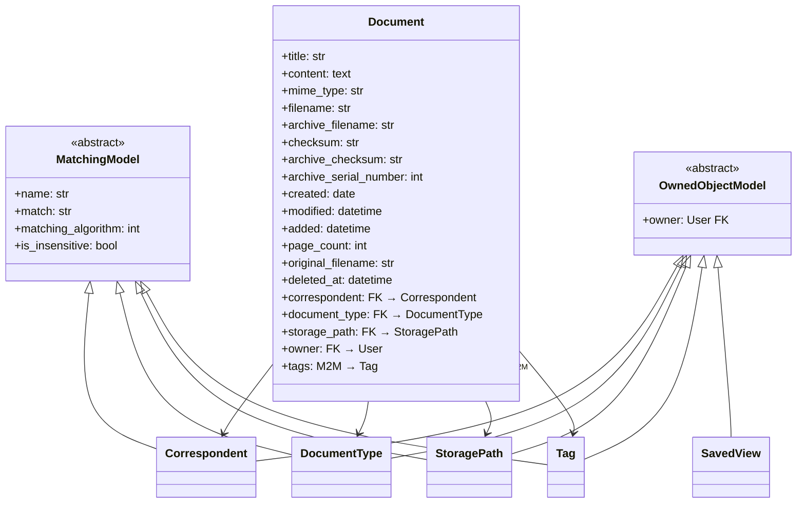

# 09 — Data Model Transformations

> **Goal**: Define every database schema change required, with Paperless source references for each table.

---

## Source of Truth: Paperless Implementation

### Key Paperless Files

| File | Lines | What We're Sourcing |
|---|---|---|
| [models.py](file:///home/de3f4ault/Desktop/Projects/synapse/tests/paperless-ngx/src/documents/models.py) | 1583 | All document-related models: `Document`, `Correspondent`, `DocumentType`, `Tag`, `StoragePath`, `SavedView`, `Workflow*`, `CustomField`, `Note`, `ShareLink` |
| [0001_initial.py](file:///home/de3f4ault/Desktop/Projects/synapse/tests/paperless-ngx/src/documents/migrations/0001_initial.py) | ~300 | Initial Django migration — shows all base table structures |

### Paperless Model Hierarchy



---

## Synapse Current Schema

The current Synapse `documents` table from [document.py](file:///home/de3f4ault/Desktop/Projects/synapse/backend/app/models/document.py):

```python
class Document(Base, TimestampMixin):
    __tablename__ = "documents"

    id: Mapped[int]
    user_id: Mapped[int]               # FK → users
    filename: Mapped[str]
    file_path: Mapped[str]
    file_type: Mapped[str]
    file_size: Mapped[int]
    content_text: Mapped[Optional[str]]
    content_hash: Mapped[Optional[str]]
    page_count: Mapped[Optional[int]]
    word_count: Mapped[Optional[int]]
    processing_status: Mapped[str]
    sector: Mapped[Optional[str]]      # ← Will be replaced by DocumentType FK
    notes: Mapped[Optional[str]]
    tags: relationship → Tag (via document_tags)  # Already exists but simple
    deleted_at: Mapped[Optional[datetime]]
```

---

## Migration Plan: 13 Alembic Migrations

### Migration 001: Core Document Enhancements

```python
# migrations/versions/001_document_core_enhancements.py
"""Add MIME type, archive path, and created_date to documents"""

def upgrade():
    op.add_column("documents", sa.Column("mime_type", sa.String(256), nullable=True))
    op.add_column("documents", sa.Column("archive_path", sa.String(500), nullable=True))
    op.add_column("documents", sa.Column("archive_checksum", sa.String(64), nullable=True))
    op.add_column("documents", sa.Column("archive_filename", sa.String(256), nullable=True))
    op.add_column("documents", sa.Column("created_date", sa.Date, nullable=True))
    op.add_column("documents", sa.Column("original_filename", sa.String(256), nullable=True))
    op.add_column("documents", sa.Column("archive_serial_number", sa.Integer, nullable=True, unique=True))

def downgrade():
    op.drop_column("documents", "archive_serial_number")
    op.drop_column("documents", "original_filename")
    op.drop_column("documents", "created_date")
    op.drop_column("documents", "archive_filename")
    op.drop_column("documents", "archive_checksum")
    op.drop_column("documents", "archive_path")
    op.drop_column("documents", "mime_type")
```

### Migration 002: Correspondents

```python
# migrations/versions/002_create_correspondents.py
"""Create correspondents table — Paperless MatchingModel pattern"""

def upgrade():
    op.create_table(
        "correspondents",
        sa.Column("id", sa.Integer, primary_key=True, autoincrement=True),
        sa.Column("name", sa.String(128), nullable=False),
        sa.Column("match", sa.String(256), default=""),
        sa.Column("matching_algorithm", sa.Integer, default=0),
        sa.Column("is_insensitive", sa.Boolean, default=True),
        sa.Column("user_id", sa.Integer, sa.ForeignKey("users.id", ondelete="CASCADE")),
        sa.Column("created_at", sa.DateTime(timezone=True), server_default=sa.func.now()),
        sa.Column("updated_at", sa.DateTime(timezone=True), server_default=sa.func.now()),
        sa.UniqueConstraint("name", "user_id", name="uq_correspondents_name_user"),
    )
    op.add_column("documents", sa.Column(
        "correspondent_id", sa.Integer,
        sa.ForeignKey("correspondents.id", ondelete="SET NULL"), nullable=True
    ))
    op.create_index("idx_documents_correspondent", "documents", ["correspondent_id"])

def downgrade():
    op.drop_index("idx_documents_correspondent")
    op.drop_column("documents", "correspondent_id")
    op.drop_table("correspondents")
```

### Migration 003: Document Types

```python
# migrations/versions/003_create_document_types.py
"""Create document_types table — replaces Synapse 'sector' column"""

def upgrade():
    op.create_table(
        "document_types",
        sa.Column("id", sa.Integer, primary_key=True, autoincrement=True),
        sa.Column("name", sa.String(128), nullable=False),
        sa.Column("match", sa.String(256), default=""),
        sa.Column("matching_algorithm", sa.Integer, default=0),
        sa.Column("is_insensitive", sa.Boolean, default=True),
        sa.Column("user_id", sa.Integer, sa.ForeignKey("users.id", ondelete="CASCADE")),
        sa.Column("created_at", sa.DateTime(timezone=True), server_default=sa.func.now()),
        sa.Column("updated_at", sa.DateTime(timezone=True), server_default=sa.func.now()),
        sa.UniqueConstraint("name", "user_id", name="uq_document_types_name_user"),
    )
    op.add_column("documents", sa.Column(
        "document_type_id", sa.Integer,
        sa.ForeignKey("document_types.id", ondelete="SET NULL"), nullable=True
    ))
    op.create_index("idx_documents_document_type", "documents", ["document_type_id"])

def downgrade():
    op.drop_index("idx_documents_document_type")
    op.drop_column("documents", "document_type_id")
    op.drop_table("document_types")
```

### Migration 004: Storage Paths

```python
# migrations/versions/004_create_storage_paths.py

def upgrade():
    op.create_table(
        "storage_paths",
        sa.Column("id", sa.Integer, primary_key=True, autoincrement=True),
        sa.Column("name", sa.String(128), nullable=False),
        sa.Column("path_template", sa.String(512), nullable=False),
        sa.Column("match", sa.String(256), default=""),
        sa.Column("matching_algorithm", sa.Integer, default=0),
        sa.Column("is_insensitive", sa.Boolean, default=True),
        sa.Column("user_id", sa.Integer, sa.ForeignKey("users.id", ondelete="CASCADE")),
        sa.Column("created_at", sa.DateTime(timezone=True), server_default=sa.func.now()),
        sa.Column("updated_at", sa.DateTime(timezone=True), server_default=sa.func.now()),
        sa.UniqueConstraint("name", "user_id", name="uq_storage_paths_name_user"),
    )
    op.add_column("documents", sa.Column(
        "storage_path_id", sa.Integer,
        sa.ForeignKey("storage_paths.id", ondelete="SET NULL"), nullable=True
    ))

def downgrade():
    op.drop_column("documents", "storage_path_id")
    op.drop_table("storage_paths")
```

### Migration 005: Tag Evolution

```python
# migrations/versions/005_evolve_tags.py
"""Add MatchingModel fields + hierarchy to existing tags table"""

def upgrade():
    # Add MatchingModel fields
    op.add_column("tags", sa.Column("match", sa.String(256), default=""))
    op.add_column("tags", sa.Column("matching_algorithm", sa.Integer, default=0))
    op.add_column("tags", sa.Column("is_insensitive", sa.Boolean, default=True))
    # Add hierarchy
    op.add_column("tags", sa.Column("parent_id", sa.Integer,
        sa.ForeignKey("tags.id", ondelete="SET NULL"), nullable=True))
    op.add_column("tags", sa.Column("is_inbox_tag", sa.Boolean, default=False))

def downgrade():
    op.drop_column("tags", "is_inbox_tag")
    op.drop_column("tags", "parent_id")
    op.drop_column("tags", "is_insensitive")
    op.drop_column("tags", "matching_algorithm")
    op.drop_column("tags", "match")
```

### Migration 006: Search Vector

```python
# migrations/versions/006_add_search_vector.py

def upgrade():
    # Generated tsvector column
    op.execute("""
        ALTER TABLE documents ADD COLUMN search_vector tsvector
        GENERATED ALWAYS AS (
            setweight(to_tsvector('english', coalesce(filename, '')), 'A') ||
            setweight(to_tsvector('english', coalesce(notes, '')), 'B') ||
            setweight(to_tsvector('english', coalesce(content_text, '')), 'C')
        ) STORED
    """)
    op.create_index("idx_documents_search_vector", "documents",
        ["search_vector"], postgresql_using="gin")

def downgrade():
    op.drop_index("idx_documents_search_vector")
    op.drop_column("documents", "search_vector")
```

### Migration 007: Saved Views

```python
# migrations/versions/007_create_saved_views.py

def upgrade():
    op.create_table("saved_views",
        sa.Column("id", sa.Integer, primary_key=True, autoincrement=True),
        sa.Column("name", sa.String(128), nullable=False),
        sa.Column("sort_field", sa.String(50), default="created_at"),
        sa.Column("sort_reverse", sa.Boolean, default=True),
        sa.Column("show_on_dashboard", sa.Boolean, default=False),
        sa.Column("show_in_sidebar", sa.Boolean, default=False),
        sa.Column("page_size", sa.Integer, default=25),
        sa.Column("user_id", sa.Integer, sa.ForeignKey("users.id", ondelete="CASCADE")),
        sa.Column("created_at", sa.DateTime(timezone=True), server_default=sa.func.now()),
        sa.Column("updated_at", sa.DateTime(timezone=True), server_default=sa.func.now()),
    )
    op.create_table("saved_view_filter_rules",
        sa.Column("id", sa.Integer, primary_key=True, autoincrement=True),
        sa.Column("saved_view_id", sa.Integer,
            sa.ForeignKey("saved_views.id", ondelete="CASCADE")),
        sa.Column("rule_type", sa.Integer, nullable=False),
        sa.Column("value", sa.String(256), nullable=True),
    )

def downgrade():
    op.drop_table("saved_view_filter_rules")
    op.drop_table("saved_views")
```

### Migration 008: Workflows

```python
# migrations/versions/008_create_workflows.py

def upgrade():
    # Triggers
    op.create_table("workflow_triggers", ...)  # See 06-workflow-automation.md

    # Actions
    op.create_table("workflow_actions", ...)  # See 06-workflow-automation.md

    # Workflows
    op.create_table("workflows", ...)  # See 06-workflow-automation.md

    # M2M joins
    op.create_table("workflow_workflow_triggers", ...)
    op.create_table("workflow_workflow_actions", ...)

    # Audit log
    op.create_table("workflow_runs", ...)

def downgrade():
    op.drop_table("workflow_runs")
    op.drop_table("workflow_workflow_actions")
    op.drop_table("workflow_workflow_triggers")
    op.drop_table("workflows")
    op.drop_table("workflow_actions")
    op.drop_table("workflow_triggers")
```

### Migration 009: Permissions

```python
# migrations/versions/009_create_permissions.py

def upgrade():
    op.create_table("document_permissions",
        sa.Column("id", sa.Integer, primary_key=True, autoincrement=True),
        sa.Column("document_id", sa.Integer,
            sa.ForeignKey("documents.id", ondelete="CASCADE")),
        sa.Column("user_id", sa.Integer,
            sa.ForeignKey("users.id", ondelete="CASCADE"), nullable=True),
        sa.Column("group_id", sa.Integer, nullable=True),
        sa.Column("permission", sa.String(20), nullable=False),
        sa.Column("created_at", sa.DateTime(timezone=True), server_default=sa.func.now()),
        sa.UniqueConstraint("document_id", "user_id", "permission",
                            name="uq_doc_user_perm"),
    )
    op.create_index("idx_doc_perms_document", "document_permissions", ["document_id"])
    op.create_index("idx_doc_perms_user", "document_permissions", ["user_id"])

def downgrade():
    op.drop_index("idx_doc_perms_user")
    op.drop_index("idx_doc_perms_document")
    op.drop_table("document_permissions")
```

### Migration 010: Share Links

```python
# migrations/versions/010_create_share_links.py

def upgrade():
    op.create_table("share_links",
        sa.Column("id", sa.Integer, primary_key=True, autoincrement=True),
        sa.Column("document_id", sa.Integer,
            sa.ForeignKey("documents.id", ondelete="CASCADE")),
        sa.Column("slug", sa.String(64), unique=True, nullable=False),
        sa.Column("created_by", sa.Integer, sa.ForeignKey("users.id")),
        sa.Column("expiration", sa.DateTime(timezone=True), nullable=True),
        sa.Column("file_version", sa.String(10), default="archive"),
        sa.Column("created_at", sa.DateTime(timezone=True), server_default=sa.func.now()),
    )
    op.create_index("idx_share_links_slug", "share_links", ["slug"])

def downgrade():
    op.drop_index("idx_share_links_slug")
    op.drop_table("share_links")
```

### Migration 011: Document Notes

```python
# migrations/versions/011_create_document_notes.py
"""Structured notes table — replaces text 'notes' column"""

def upgrade():
    op.create_table("document_notes",
        sa.Column("id", sa.Integer, primary_key=True, autoincrement=True),
        sa.Column("document_id", sa.Integer,
            sa.ForeignKey("documents.id", ondelete="CASCADE")),
        sa.Column("content", sa.Text, nullable=False),
        sa.Column("user_id", sa.Integer,
            sa.ForeignKey("users.id", ondelete="CASCADE")),
        sa.Column("created_at", sa.DateTime(timezone=True), server_default=sa.func.now()),
        sa.Column("updated_at", sa.DateTime(timezone=True), server_default=sa.func.now()),
        sa.Column("deleted_at", sa.DateTime(timezone=True), nullable=True),
    )

def downgrade():
    op.drop_table("document_notes")
```

### Migration 012: Task Tracking

```python
# migrations/versions/012_create_synapse_tasks.py

def upgrade():
    op.create_table("synapse_tasks",
        sa.Column("id", sa.Integer, primary_key=True, autoincrement=True),
        sa.Column("task_id", sa.String(64), unique=True, nullable=False),
        sa.Column("task_name", sa.String(128), nullable=False),
        sa.Column("task_file_name", sa.String(256), nullable=True),
        sa.Column("type", sa.Integer, nullable=False),
        sa.Column("status", sa.String(30), default="PENDING"),
        sa.Column("result", sa.Text, nullable=True),
        sa.Column("acknowledged", sa.Boolean, default=False),
        sa.Column("related_document_id", sa.Integer, nullable=True),
        sa.Column("date_created", sa.DateTime(timezone=True), server_default=sa.func.now()),
        sa.Column("date_started", sa.DateTime(timezone=True), nullable=True),
        sa.Column("date_done", sa.DateTime(timezone=True), nullable=True),
    )
    op.create_index("idx_synapse_tasks_task_id", "synapse_tasks", ["task_id"])

def downgrade():
    op.drop_index("idx_synapse_tasks_task_id")
    op.drop_table("synapse_tasks")
```

### Migration 013: Backfill sector → DocumentType

```python
# migrations/versions/013_backfill_sector_to_document_type.py
"""Data migration: convert sector values to document_type records"""

def upgrade():
    # Get all distinct sector values
    conn = op.get_bind()
    sectors = conn.execute(
        sa.text("SELECT DISTINCT sector, user_id FROM documents WHERE sector IS NOT NULL AND sector != 'Uncategorized'")
    ).fetchall()

    for sector, user_id in sectors:
        # Create DocumentType for each sector
        result = conn.execute(
            sa.text("INSERT INTO document_types (name, user_id) VALUES (:name, :uid) "
                    "ON CONFLICT (name, user_id) DO UPDATE SET name = :name RETURNING id"),
            {"name": sector, "uid": user_id}
        )
        dt_id = result.fetchone()[0]

        # Update documents with this sector
        conn.execute(
            sa.text("UPDATE documents SET document_type_id = :dt_id "
                    "WHERE sector = :sector AND user_id = :uid"),
            {"dt_id": dt_id, "sector": sector, "uid": user_id}
        )

def downgrade():
    # Reverse: copy document_type names back to sector
    conn = op.get_bind()
    conn.execute(
        sa.text("""
            UPDATE documents d SET sector = dt.name
            FROM document_types dt
            WHERE d.document_type_id = dt.id
        """)
    )
```

---

## Engineering Tasks

1. **Create all 13 Alembic migrations** in dependency order
2. **Generate corresponding SQLAlchemy models** for each new table
3. **Export all models** in `models/__init__.py`
4. **Write backfill script** for sector → DocumentType migration
5. **Write backfill script** for MIME type detection on existing documents
6. **Test all migrations** — up and down — on a copy of the database
7. **Verify rollback** — ensure downgrade paths work
