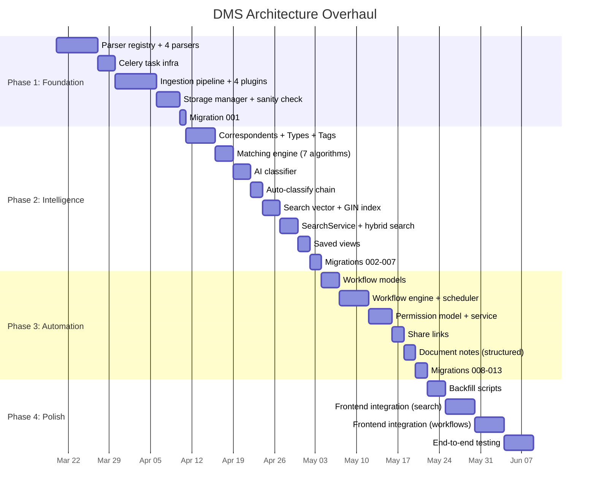

# 10 — Incremental Migration Strategy

> **Goal**: Safe, backward-compatible migration from current Synapse to the new architecture.

---

## Source-to-Target File Map

This is the complete map of which Synapse files are created, modified, or deprecated across all phases.

### New Files Created

| Phase | File | Purpose | Sourced From (Paperless) |
|---|---|---|---|
| 1 | `services/parsers/base.py` | `BaseDocumentParser` ABC | [parsers.py](file:///home/de3f4ault/Desktop/Projects/synapse/tests/paperless-ngx/src/documents/parsers.py) L1-180 |
| 1 | `services/parsers/registry.py` | `ParserRegistry` → MIME dispatch | [parsers.py](file:///home/de3f4ault/Desktop/Projects/synapse/tests/paperless-ngx/src/documents/parsers.py) L180-250 |
| 1 | `services/parsers/pdf_parser.py` | PDF → OCR text + PDF/A archive | [parsers.py](file:///home/de3f4ault/Desktop/Projects/synapse/tests/paperless-ngx/src/documents/parsers.py) L250+ |
| 1 | `services/parsers/text_parser.py` | TXT/MD/HTML → plain text | Custom |
| 1 | `services/parsers/office_parser.py` | DOCX/XLSX → text via python-docx/openpyxl | Custom |
| 1 | `services/parsers/epub_parser.py` | EPUB → text via ebooklib | Custom |
| 1 | `services/ingestion/pipeline.py` | `PipelineRunner` → plugin chain | [consumer.py](file:///home/de3f4ault/Desktop/Projects/synapse/tests/paperless-ngx/src/documents/consumer.py) |
| 1 | `services/ingestion/plugins/base.py` | `IngestionPlugin` ABC | [plugins/base.py](file:///home/de3f4ault/Desktop/Projects/synapse/tests/paperless-ngx/src/documents/plugins/base.py) |
| 1 | `services/ingestion/plugins/preflight.py` | Validation + dedup | [consumer.py](file:///home/de3f4ault/Desktop/Projects/synapse/tests/paperless-ngx/src/documents/consumer.py) L1-100 |
| 1 | `services/ingestion/plugins/parser_plugin.py` | Parse + OCR via registry | [consumer.py](file:///home/de3f4ault/Desktop/Projects/synapse/tests/paperless-ngx/src/documents/consumer.py) L300-500 |
| 1 | `services/ingestion/plugins/store_plugin.py` | Save to dual storage | [consumer.py](file:///home/de3f4ault/Desktop/Projects/synapse/tests/paperless-ngx/src/documents/consumer.py) L600-700 |
| 1 | `services/ingestion/plugins/index_plugin.py` | Index + vector embed | Custom (Synapse-native) |
| 1 | `services/background/progress.py` | `ProgressManager` | [plugins/base.py](file:///home/de3f4ault/Desktop/Projects/synapse/tests/paperless-ngx/src/documents/plugins/base.py) |
| 1 | `config/storage.py` | Storage directory config | Django settings |
| 1 | `services/storage/file_manager.py` | Template paths, auto-rename | [file_handling.py](file:///home/de3f4ault/Desktop/Projects/synapse/tests/paperless-ngx/src/documents/file_handling.py) |
| 1 | `services/storage/sanity_check.py` | Integrity verification | [sanity_checker.py](file:///home/de3f4ault/Desktop/Projects/synapse/tests/paperless-ngx/src/documents/sanity_checker.py) |
| 2 | `models/matching.py` | `MatchingModel` abstract base | [models.py](file:///home/de3f4ault/Desktop/Projects/synapse/tests/paperless-ngx/src/documents/models.py) L100-150 |
| 2 | `models/correspondent.py` | Correspondent model | [models.py](file:///home/de3f4ault/Desktop/Projects/synapse/tests/paperless-ngx/src/documents/models.py) L150-180 |
| 2 | `models/document_type.py` | DocumentType model | [models.py](file:///home/de3f4ault/Desktop/Projects/synapse/tests/paperless-ngx/src/documents/models.py) L180-210 |
| 2 | `models/storage_path.py` | StoragePath model | [models.py](file:///home/de3f4ault/Desktop/Projects/synapse/tests/paperless-ngx/src/documents/models.py) L210-250 |
| 2 | `models/saved_view.py` | SavedView + FilterRule | [models.py](file:///home/de3f4ault/Desktop/Projects/synapse/tests/paperless-ngx/src/documents/models.py) L656-779 |
| 2 | `services/classification/matching.py` | 7 matching algorithms | [matching.py](file:///home/de3f4ault/Desktop/Projects/synapse/tests/paperless-ngx/src/documents/matching.py) |
| 2 | `services/classification/ai_classifier.py` | Gemini zero-shot | Custom (Synapse advantage) |
| 2 | `services/classification/auto_assign.py` | Auto-classify chain | [signals/handlers.py](file:///home/de3f4ault/Desktop/Projects/synapse/tests/paperless-ngx/src/documents/signals/handlers.py) |
| 2 | `services/search/service.py` | Hybrid search | [index.py](file:///home/de3f4ault/Desktop/Projects/synapse/tests/paperless-ngx/src/documents/index.py) |
| 2 | `api/rest/search.py` | Search endpoints | Custom |
| 3 | `models/workflow.py` | Workflow models | [models.py](file:///home/de3f4ault/Desktop/Projects/synapse/tests/paperless-ngx/src/documents/models.py) L980-1583 |
| 3 | `services/workflows/engine.py` | Workflow execution | [signals/handlers.py](file:///home/de3f4ault/Desktop/Projects/synapse/tests/paperless-ngx/src/documents/signals/handlers.py) L1100-1546 |
| 3 | `services/workflows/scheduler.py` | Scheduled workflows | [tasks.py](file:///home/de3f4ault/Desktop/Projects/synapse/tests/paperless-ngx/src/documents/tasks.py) L391-517 |
| 3 | `models/document_permission.py` | ACL + ShareLink | [permissions.py](file:///home/de3f4ault/Desktop/Projects/synapse/tests/paperless-ngx/src/documents/permissions.py) |
| 3 | `services/permissions/service.py` | Permission checks | [permissions.py](file:///home/de3f4ault/Desktop/Projects/synapse/tests/paperless-ngx/src/documents/permissions.py) |
| 3 | `models/task.py` | Task status tracking | [models.py](file:///home/de3f4ault/Desktop/Projects/synapse/tests/paperless-ngx/src/documents/models.py) L870-980 |

### Files Modified

| Phase | File | What Changes |
|---|---|---|
| 1 | `models/document.py` | Add columns: `mime_type`, `archive_path`, `archive_checksum`, `created_date`, `original_filename`, `archive_serial_number` |
| 1 | `core/celery_app.py` | Add task queues, beat schedule |
| 2 | `models/document.py` | Add FKs: `correspondent_id`, `document_type_id`, `storage_path_id`. Add `search_vector` generated column |
| 2 | `models/tag.py` | Add: `match`, `matching_algorithm`, `is_insensitive`, `parent_id`, `is_inbox_tag` |
| 2 | `modules/documents/repository.py` | Add `search_documents()` with GIN index query |
| 2 | `api/rest/documents.py` | Add filter parameters, search query support |
| 3 | `api/rest/documents.py` | Add permission middleware |
| 3 | `modules/documents/repository.py` | Replace `user_id` filter with 3-tier visibility |

### Files Deprecated (Not Removed Until Fully Replaced)

| Phase | File | Replaced By |
|---|---|---|
| 1 | `services/document/ocr_processor.py` (196 lines) | `services/parsers/pdf_parser.py` |
| 1 | `services/document/processing.py` (106 lines) | `services/ingestion/pipeline.py` |
| 1 | `services/document/document_processor.py` (388 lines) | `services/background/tasks.py consume_document()` |
| 2 | `services/document/topic_tagger.py` (131 lines) | `services/classification/auto_assign.py` |

---

## Phase Timeline



---

## Backward Compatibility Rules

1. **No existing columns are removed** — `sector` remains until DocumentType is fully operational
2. **All new FK columns are nullable** — existing documents are unaffected
3. **New tables are purely additive** — no schema conflicts
4. **Old code paths remain importable** — `processing.py`, `document_processor.py` still work
5. **API response format unchanged** — new fields are added, none removed
6. **Feature flags** control activation — `USE_NEW_PIPELINE=true` switches upload path

---

## Rollback Procedures

### Phase 1 Rollback

```bash
# Revert config
unset SYNAPSE_USE_NEW_PIPELINE
# Revert migration
alembic downgrade -1  # Removes mime_type, archive_path columns
# Code: simply don't import services/parsers/ or services/ingestion/
```

### Phase 2 Rollback

```bash
# Run reverse data migration (copy document_type back to sector)
python scripts/reverse_sector_migration.py
# Revert migrations (drops correspondents, document_types, etc.)
alembic downgrade 001
```

### Phase 3 Rollback

```bash
# Drop workflow + permission tables
alembic downgrade 007
# Remove permission middleware from API
```

---

## Engineering Tasks

1. **Create feature flag** — `USE_NEW_PIPELINE` environment variable
2. **Write backfill scripts** — MIME types, sector→DocumentType, file path migration
3. **Write regression test suite** — existing API endpoints must pass unchanged
4. **Create Alembic migrations** in order (001-013)
5. **Document rollback procedures** for each phase
6. **Test migration up/down** on copy of production database
