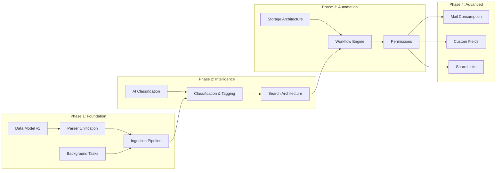

# DMS Architecture Overhaul — Synapse Evolution Blueprint

> **Mission**: Transform Synapse from a document viewer into a **next-generation intelligent Document Management System** that achieves architectural parity with Paperless-ngx, then surpasses it through AI-native capabilities.

---

## Operation Overview

The DMS Architecture Overhaul is the engineering blueprint for evolving Synapse's document subsystem. It combines the **proven DMS patterns from Paperless-ngx** with Synapse's **unique AI/RAG/vector-search capabilities** to create something neither system could achieve alone.

### Strategy

```
Phase 1: Achieve architectural parity with Paperless-ngx
Phase 2: Leverage Synapse's AI stack to surpass Paperless
```

### Branch

All implementation work happens on **`feature/dms-architecture-overhaul`**.

---

## Documentation Index

| File | Phase | Scope |
|---|---|---|
| [00-architecture-mapping.md](./00-architecture-mapping.md) | Foundation | Complete subsystem mapping (15 areas) between Paperless and Synapse |
| [01-parser-unification.md](./01-parser-unification.md) | Phase 1 | Unified DocumentParser base, registry, 4 parser implementations |
| [02-ingestion-pipeline.md](./02-ingestion-pipeline.md) | Phase 1 | Plugin-based consumer pipeline with 4 ingestion sources |
| [03-classification-tagging.md](./03-classification-tagging.md) | Phase 2 | MatchingModel, Tag/Correspondent/DocumentType, rules + AI classification |
| [04-search-architecture.md](./04-search-architecture.md) | Phase 2 | Dual search (PostgreSQL FTS + Qdrant vector), index schema, saved views |
| [05-storage-architecture.md](./05-storage-architecture.md) | Phase 3 | Dual-path storage, PDF/A archival, storage templates, checksums |
| [06-workflow-automation.md](./06-workflow-automation.md) | Phase 3 | Trigger-action workflow engine |
| [07-permission-model.md](./07-permission-model.md) | Phase 3 | Object-level ACLs, sharing, group permissions |
| [08-background-tasks.md](./08-background-tasks.md) | Phase 1 | Celery task infrastructure, queues, retries |
| [09-data-model-transformations.md](./09-data-model-transformations.md) | All Phases | Full database schema changes and Alembic migrations |
| [10-migration-strategy.md](./10-migration-strategy.md) | All Phases | Incremental migration path with backward compatibility |
| [11-synapse-advantages.md](./11-synapse-advantages.md) | Phase 2+ | AI superpowers that surpass Paperless |

---

## Implementation Order



---

## Reference Material

| Artifact | Location |
|---|---|
| Paperless-ngx source | `tests/paperless-ngx/src/` |
| Synapse documents backend | `backend/app/modules/documents/` |
| Synapse document model | `backend/app/models/document.py` |
| Synapse OCR processor | `backend/app/services/ocr/processor.py` |
| Synapse document service | `backend/app/services/document/service.py` |
